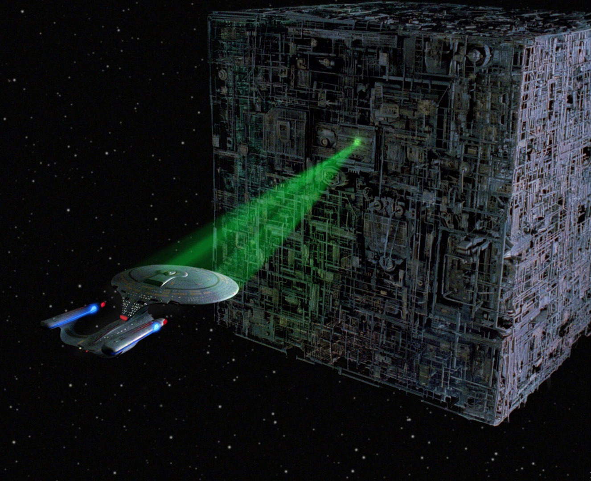

```{r global options, include=FALSE}
library(rmarkdown)
library(knitr)
figpath<-'figures/'
opts_chunk$set(fig.width=9, fig.height=6, fig.path=figpath,
               warning=FALSE, message=FALSE)
```

# Background

## Founding developers

<div align="center"></img></div>

## Long term collaborators


## _ANTs_:  General purpose library for multivariate image registration, segmentation & statistical analysis tools

* 170,000+ lines of C++, 6$+$ years of work, 15+ collaborators.

* Generic mathematical methods that are tunable for
application specific domains:  no-free lunch

* Deep testing on multiple platforms ... osx, linux, windows.

* Several "wins" in public knock-abouts ( [Klein 2009](http://www.ncbi.nlm.nih.gov/pubmed/19195496), [Murphy 2011](http://www.ncbi.nlm.nih.gov/pubmed/21632295), [SATA 2012 and 2013](http://www.ncbi.nlm.nih.gov/pmc/articles/PMC3837555/), [BRATS 2013](http://martinos.org/qtim/miccai2013/proc_brats_2013.pdf), others )

```
    An algorithm must use prior knowledge about a problem
    to do well on that problem
```


<!--

## Built on ITK

* image registration framework

* many other classes such as:
    + `itkScalarImageToRGBImageFilter`
    + `itkLabelOverlapMeauresImageFilter`
    + `itkBSplineScatteredDataPointSetToImageFilter`
    + `itkStochasticFractalDimensionImageFilter`

## ANTs development philosophy:<br><small>Assimilate the optimal components of other approaches</small>



_"We are the Borg. Your biological and technological distinctiveness will be added to our own. Resistance is futile."_


## *The Big 5*

* <span style="color:red">image registration</span> (`antsRegistration.cxx`)

* <span style="color:red">bias correction</span> (`N4BiasFieldCorrection.cxx`)

* multivariate template construction (`antsMultivariateTemplateConstruction.sh`)

* multivariate segmentation (`Atropos.cxx`)

* cortical thickness (`KellyKaposki.cxx` and `antsCorticalThickness.sh`)

## *ANTsR*<br>for statistics and visualization

# *ANTs* optimizes mathematically well-defined <span style="color:red;">objective functions</span> guided by <span style="color:red;">prior knowledge</span>  ...

# ... including that of developers, domain experts and other colleagues ...

# plug *your ideas* into our software to gain insight into biomedical data ...

# our strong <span style="color:red;">mathematical and software engineering</span> foundation leads to near limitless opportunities for innovation in a variety of application domains
-->
