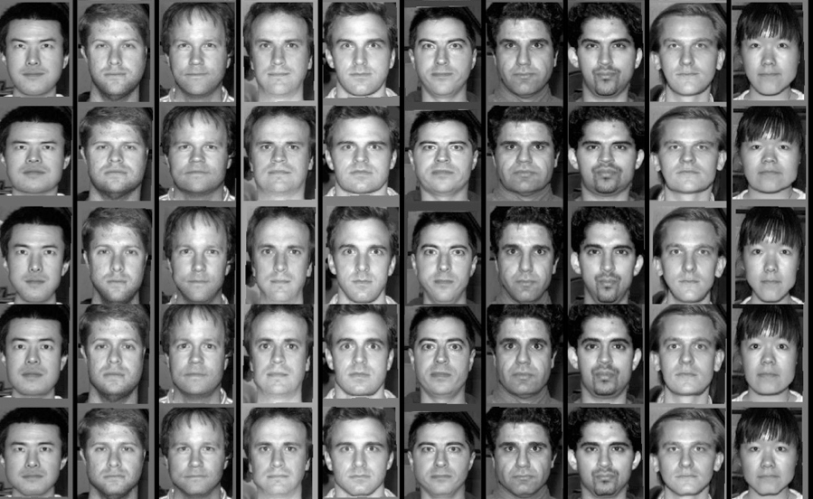
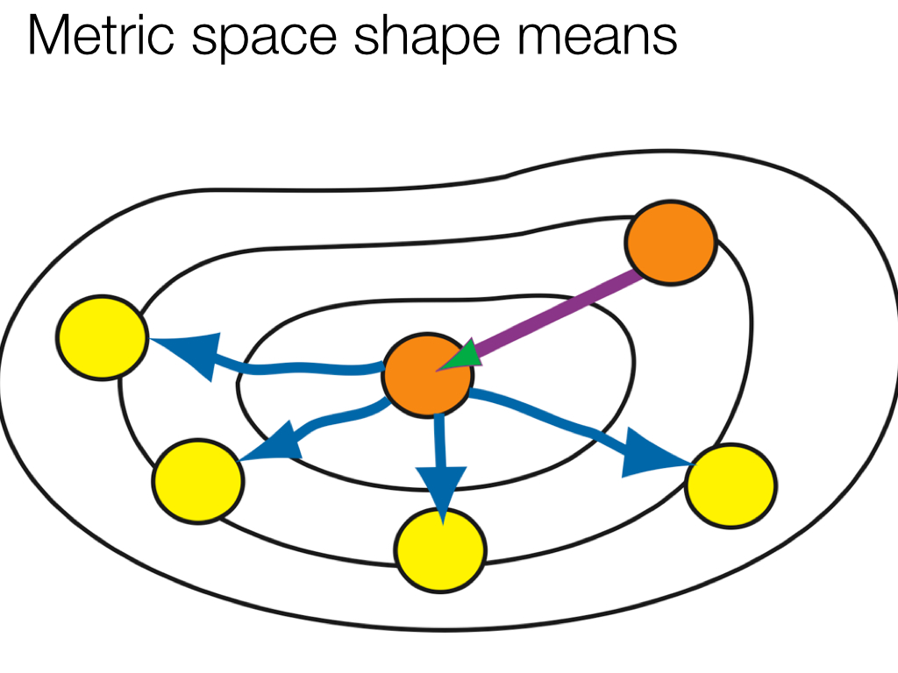
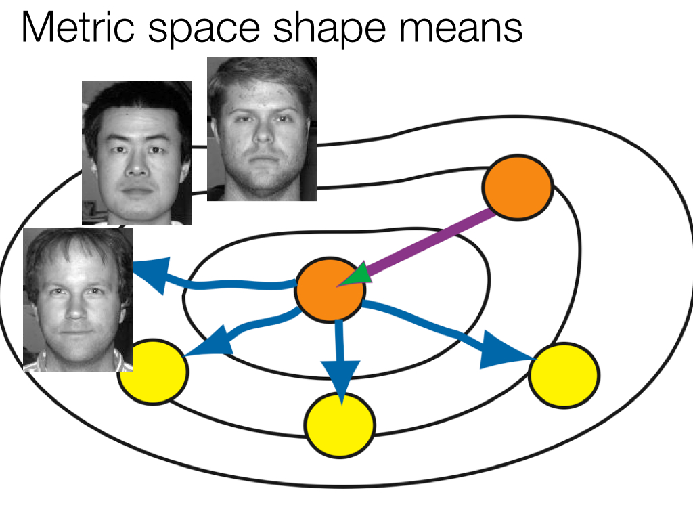
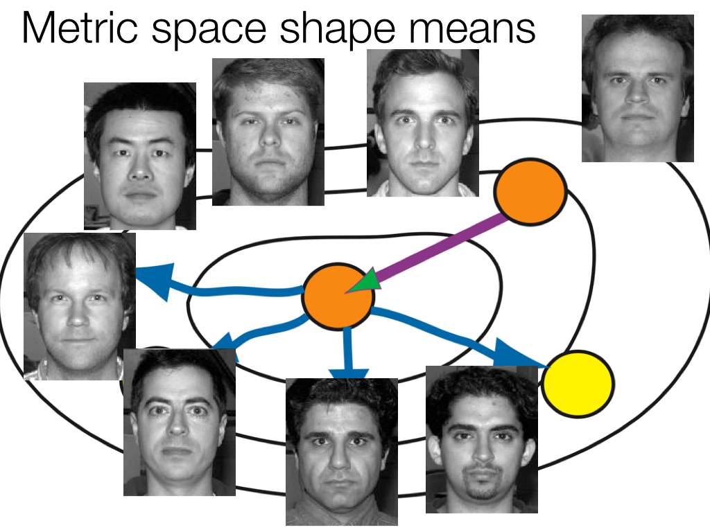
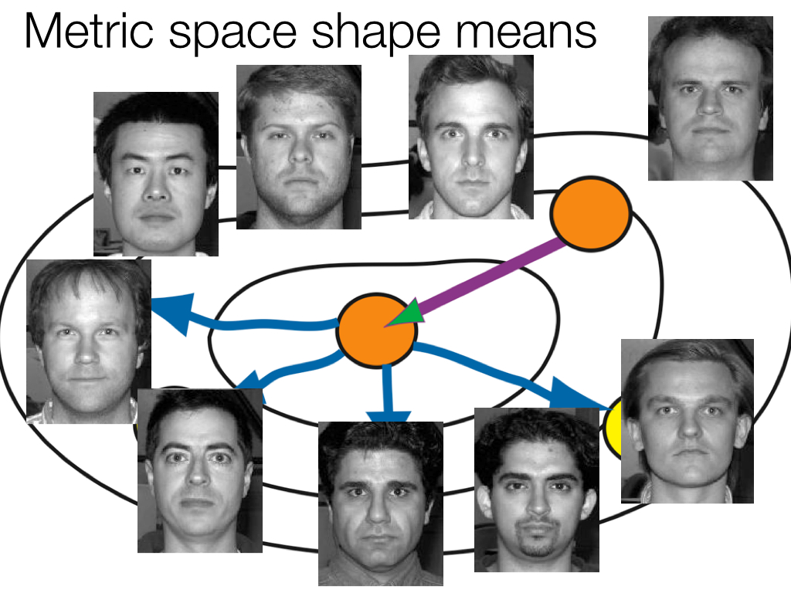
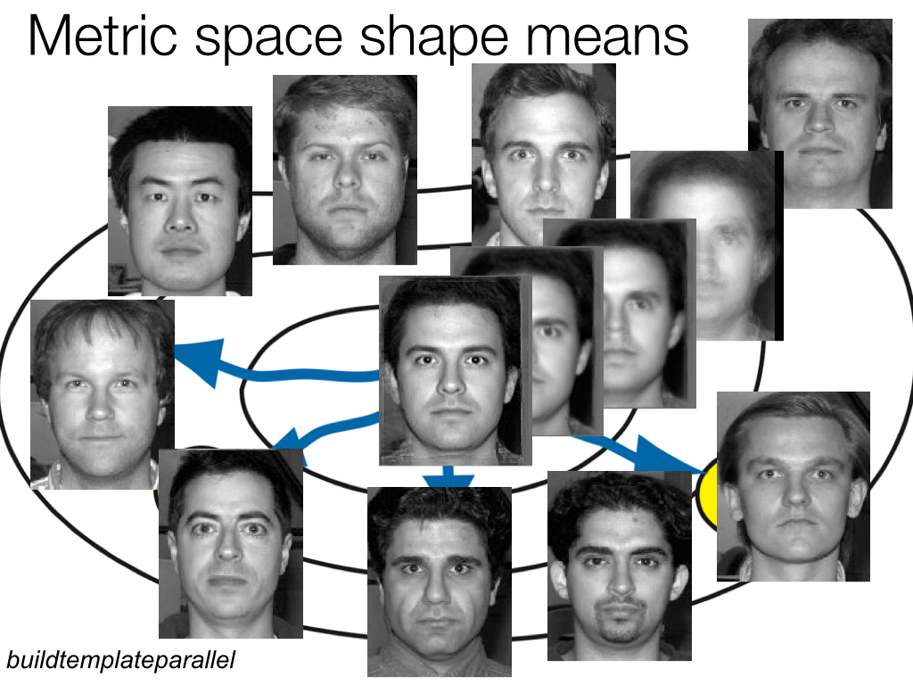
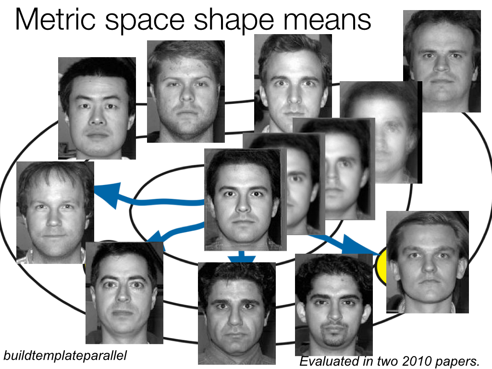

```{r global options, include=FALSE}
library(rmarkdown)
library(knitr)
figpath<-'figures/'
opts_chunk$set(fig.width=9, fig.height=6, fig.path=figpath,
               warning=FALSE, message=FALSE)
```


## 

<div align="center"></img></div>

This talk is online at [http://stnava.github.io/ANTs2015/](http://stnava.github.io/ANTs2015/) with colored [links](http://stnava.github.io/ANTs2015/) meant to be clicked for more information.

# Background

## Founding developers

<div align="center"></img></div>

BBA & NT

## Long-term collaborators


$+$ [neurodebian](http://neuro.debian.net/pkgs/ants.html), [slicer](http://www.slicer.org/), [brainsfit](https://github.com/BRAINSia/BRAINSTools), [nipype](http://nipy.sourceforge.net/nipype/), [itk](http://www.itk.org) and more ...


##


a pride: common way of doing things

... in a competitive world ...

## Definitions

* Registration $=$ estimate an "optimal" geometric mapping between image pairs or image sets (e.g. Affine)

* <span style="color:grey;"> Similarity $=$ a function relating one image to another, given a transformation (e.g. mutual information)</span>

* Diffeomorphisms $=$ differentiable map with differentiable inverse (e.g. "silly putty", viscous fluid)  

* <span style="color:grey;">Segmentation $=$ labeling tissue or anatomy in images, usually automated (e.g. K-means)</span>

* Multivariate $=$ using many voxels or measurements at once (e.g. PCA, $p >> n$ ridge regression)</span>

* <span style="color:grey;">Multiple modality $=$ using many modalities at once (e.g. DTI and T1 and BOLD)</span>

* MALF: multi-atlas label fusion - using anatomical dictionaries to label new data

* <span style="color:grey;">Solutions to challenging statistical image processing problems usually need elements from each of the above</span>


## Image mapping & perception: 1878


* Francis Galton: Can we see criminality in the face?

* (maybe he should have used *ANTs*?)

## Image mapping & biology: 1917


D'Arcy Thompson

## Initial scope


... just do a better registration (tell story) ...

## *ANTs* Lineage


References: @Horn1981, @Gee1993, @Grenander1993, @Thompson2001, @Miller2002, @Shen2002, @Arnold2014, @Thirion1998, @Rueckert1999, @Fischl2012, @Ashburner2012

## Diffeomorphisms

<div align="center"></img></div>

plausible physical modeling of large, invertible deformations

"differentiable map with differentiable inverse"

## Fine-grained and flexible maps


... to correct a misconception about diffeomorphisms ...

## Diffeomorphisms: image parameterization in a metric space



## General purpose library for multivariate image registration, segmentation & statistical analysis tools

* 170,000+ lines of C++, 6$+$ years of work, 15+ collaborators.

* Generic mathematical methods that are tunable for
application specific domains:  no-free lunch

* Deep testing on multiple platforms ... osx, linux, windows.

* Several "wins" in public knock-abouts ( [Klein 2009](http://www.ncbi.nlm.nih.gov/pubmed/19195496), [Murphy 2011](http://www.ncbi.nlm.nih.gov/pubmed/21632295), [SATA 2012 and 2013](http://www.ncbi.nlm.nih.gov/pmc/articles/PMC3837555/), [BRATS 2013](http://martinos.org/qtim/miccai2013/proc_brats_2013.pdf), others )

```
    An algorithm must use prior knowledge about a problem
    to do well on that problem
```

## *ANTs*: Beyond Registration


[Atropos](http://www.ncbi.nlm.nih.gov/pubmed/?term=atropos+tustison) segmentation, [N4 inhomogeneity correction](http://www.ncbi.nlm.nih.gov/pubmed/?term=N4+tustison), [Eigenanatomy](http://www.ncbi.nlm.nih.gov/pubmed/?term=eigenanatomy+avants), [SCCAN](http://www.ncbi.nlm.nih.gov/pubmed/?term=sparse+canonical+avants), [Prior-constrained PCA](http://www.ncbi.nlm.nih.gov/pubmed/24852460), and [atlas-based label fusion](http://www.ncbi.nlm.nih.gov/pmc/articles/PMC4009425/) and [MALF](http://www.ncbi.nlm.nih.gov/pubmed/21237273) (powerful expert systems for segmentation)


## On documentation


documentation is important

## On documentation


... developers can be blind to doc deficiencies

while users are blind to what we provide!
# ANTs Impact

## ANTs Statistics


## ANTs & Neuroscience

We need statistical image analysis <br />at several scales in modern neuroscience

* Macro: *in vivo* structural and functional MRI

* Micro:  high-resolution post-mortem MRI links with in vivo MRI

* Nano: neuron reconstruction ...

* Solutions that are consistent across these scales have the potential
to build multi-scale feature sets or templates and provide new
insights into brain structure and function

* E.g. Parcellation constraints based on histology, tractography, function ...

* Statistical definitions of anatomy/pathology?  

* Reinvention of these solutions within each lab ... can we mitigate this?

* Reduce, reuse, recycle ...

## Financial impact

* The **high error rate** in software makes testing for quality assurance critically important. 

* Bugs exist **Everywhere**: so don't freak out if we admit we have bugs:  we're just being honest ( and not all devs are )

* Virtually every business in the United States now depends on software for development, production, distribution, and after-sales support of products and services.

* A 2002 NIST study estimated the direct costs to the software supply chain due to failure to identify (**successfully test for**) "bugs" 

* We are better at this than most ... **not perfect**

* The estimate of direct costs compiled from industry survey data for the U.S. economy was **\$60 billion per year**

* ... this estimate did not include costs to end users such as lost business (for example, the cost of shutting down the New York Mercantile Exchange in 1998 due to a software failure).

## Reproducibility 

* Consider the recent paper: [Freesurfer, laplacian, DiReCT thickness in longitudinal stroke](http://ac.els-cdn.com/S2213158214001260/1-s2.0-S2213158214001260-main.pdf?_tid=8e6f5248-335d-11e4-ba4f-00000aab0f02&acdnat=1409743944_6615d59eb5709e6bcb1aca76450f7d93)

* We "pre-wrote" a comment: [Instrumentation bias in the use and evaluation of scientific software](http://www.ncbi.nlm.nih.gov/pmc/articles/PMC3766821/?report=reader)

* With these guys:

* 

## Hired by Google


# Optimal Templates

## "Optimal" templates (?)

* unbiased wrt measurement space 

* space is non-linear: reference matters

* encodes prior information: still just averages (usually)

* concept extends across modalities, anatomy, temporality, etc

## Faces, brains, whatever ... 



## Faces, brains, whatever ... 


## Faces, brains, whatever ... 


## Faces, brains, whatever ... 



## Faces, brains, whatever ... 


## Faces, brains, whatever ... 


## Faces, brains, whatever ... 


## Faces, brains, whatever ... 


## Faces, brains, whatever ... 



## Faces, brains, whatever ... 



## Faces, brains, whatever ... 


## Faces, brains, whatever ... 


## Faces, brains, whatever ... 


## Faces, brains, whatever ... 


## Faces, brains, whatever ... 


## Faces, brains, whatever ... 



## Faces, brains, whatever ... 



see [ANTs site](stnava.github.io/ANTs) and [ANTs Documentation page](stnava.github.io/ANTsDoc)

## Templates from ANTs Colleagues ( not us )


## Templates unlock modalities


# Evaluation

## 

<div align="center"></img></div>


# ANTs brain morphology<br><br>[<small>"*Large-scale evaluation of ANTs and FreeSurfer cortical thickness measurements*"</small>](http://www.ncbi.nlm.nih.gov/pubmed/24879923)


## Cortical thickness studies:
```{r, results='asis', echo = FALSE}
conditions <- c( "Huntington’s disease", "schizophrenia", "bipolar disorder",
                 "Alzheimer’s disease", "frontotemporal dementia", "Parkinson’s disease",
                 "Williams syndrome", "multiple sclerosis", "autism", "migraines",
                 "chronic smoking", "alcoholism", "cocaine addiction", "Tourette syndrome in children",
                 "scoliosis in female adolescents", "early-onset blindness", "chronic pancreatitis",
                 "obsessive-compulsive disorder", "ADHD", "obesity", "heritable depression",
                 "elderly depression", "age", "gender", "untreated male-to-female transsexuality",
                 "handedness", "intelligence", "athletic ability", "meditative practices", "musical ability",
                 "tendency toward criminality", "childhood sexual abuse in female adolescents",
                 "Tetris-playing ability in female adolescents", "traumatic brain injury" )

conditionsDF <- data.frame( Column1 = conditions[1:floor( 0.5*length(conditions) )], Column2 = conditions[( 1+floor( 0.5*length(conditions) ) ):length(conditions)] )
knitr::kable( conditionsDF )
```

## *ANTs*-related background

* Sandy, Brian, and <span style="color:red;">DiReCT</span>
  + used other tools such as FMRIB's Automated Segmentation Tool (FAST)
  + `KellySlater.cxx`
  * scripts "adequate for Penn data"
* `KellyKapowski.cxx` and `antsCorticalThickness.sh`
* _"Let's evaluate on open data."_
* and, eventually, _"Let's compare with FreeSurfer."_

## The *ANTs* structural brain mapping workflow


## Basic components of the pipeline

<div align="center"></img></div>

1. template building (offline)
2. brain extraction
3. cortical thickness estimation
4. cortical parcellation

## Template building

*Tailor data to your specific cohort*

<div align="center"></img></div>

* Templates representing the average mean shape and intensity are built directly from the cohort to be analyzed, e.g. pediatric vs. middle-aged brains.
* Acquisition and anonymization (e.g. defacing) protocols are often different.

## Template building (cont.)

<div align="center"></img></div>

Each template is [processed](https://github.com/ntustison/antsCookTemplatePriorsExample)
to produce auxiliary images which are used for brain extraction and brain segmentation.

## Brain extraction comparison<br>*ANTs* vs. FreeSurfer

<div align="center"></img></div>

Comparison with de facto standard FreeSurfer package.  Note the difference in separation of
the gray matter from the surrounding CSF.  (0 failures out of 1205 scans)

## Brain segmentation

<div align="center"></img></div>

Randomly selected healthy individuals.  Atropos gets good performance across ages.

## Cortical thickness estimation

<div align="center"></img></div>

In contrast to FreeSurfer which warps coupled surface meshes to segment the gray matter, *ANTs* diffeomorphically registers the white matter to the combined gray/white matters while simultaneously estimating thickness.


## _But without ground truth, how does one evaluate the pipeline?_

* Use age and gender (demographic information) in training/prediction paradigm
* Public data sets (IXI, NKI, Oasis, MMRR)
* $>$ 1200 subjects, age 7 to over 90 years old

## Prediction from cortical thickness data:<br>gender and age

<div align="center"></img></div>


## Regional importance <br>comparison

$AGE \sim VOLUME + GENDER + \sum_{i=1}^{62} T(DKT_i)$

<div align="center"></img></div>

*ANTs* (left) vs. FreeSurfer (right)

## Regional importance comparison (cont.)

<div align="center"></img></div>

## Cortical thickness extensions

<!--
# New work

## RKRNS

[link](http://stnava.github.io/RKRNS/)

What mathematical encoding of language reflects both brain activity and
"our" understanding of semantics?

## RIPMARC: Imputation, strutural networks, etc.


MICCAI 2014, Neuroimage 2015

## Big image registration
-->

# Longitudinal processing <!--with ANTs>

<!--
## ANTs longitudinal pipeline


see [link to paper](http://link.springer.com/chapter/10.1007/978-3-642-15705-9_40)

and [unbiased analysis paper](http://www.ncbi.nlm.nih.gov/pubmed/20005963)

plus [longitudinal recommendation paper](http://www.ncbi.nlm.nih.gov/pmc/articles/PMC3581852/)
-->

## `antsLongitudinalCorticalThickness.sh`


## Longitudinal TBI with lesions (segmentation)


## Longitudinal TBI with lesions (cortical thickness)


<!--
## ANTs longitudinal pipeline


-->

# Cortical thickness with lesions

## antsCorticalThickness.sh is adaptable!

1. Register subject (or single subject template) to normal template.

2. Transform lesion mask to normal template.

3. Create additional "lesion" prior, i.e. ```SmoothImage 3 ${lesionMask} 1 ${lesionPrior} 1```.

4.  Subtract out lesion prior from all other priors and keep values $\in [0,1]$.

## Modified template spatial priors


## antsCorticalThickness.sh using lesion prior


Only change to the command call is an additional '-c WM[7]' which means "combine
the 7<sup>th</sup> prior, i.e. lesion, to the white matter for cortical thickness calculation."

# Registration & statistics:<br /> Frontiers and innovation

## multivariate statistical fields arise from fused modalities


*Many opportunities for statistical advancements*

## ITK+ANTs+R = <span style="color:red;">*ANTsR*</span>

## Agnostic statistics


[McMillan et al.](http://www.ncbi.nlm.nih.gov/pmc/articles/PMC3961542/)

## A Quick <span style="color:grey;">*ANTsR*</span> example
```{r loadantsr,results='hide',echo=FALSE,message=FALSE}
library(ANTsR)
```

This is an executable *ANTsR* code block - *N*-dimensional statistics to go with
our *N*-dimensional image processing software!
```{r loadimages,message=FALSE,warning=FALSE,results='hide'}
library(ANTsR)
dim<-2
filename<-getANTsRData('r16')
img<-antsImageRead( filename , dim )
filename<-getANTsRData('r64')
img2<-antsImageRead( filename , dim )
mask<-getMask(img,50,max(img),T)
mask2<-getMask(img,150,max(img),T)
nvox<-sum( mask == 1 )
nvox2<-sum( mask2 == 1 )
```
The brain has `r nvox` voxels ...

## A Quick <span style="color:grey;">*ANTsR*</span> example

Simulate a population morphometry study - a "VBM" ...
```{r morph,results='hide'}
simnum<-10
imglist<-list()
imglist2<-list()
for ( i in 1:simnum ) {
  img1sim<-antsImageClone(img)
  img1sim[ mask==1 ]<-rnorm(nvox,mean=0.5)
  img1sim[ mask2==1 ]<-rnorm(nvox2,mean=2.0)
  img2sim<-antsImageClone(img2)
  img2sim[ mask==1 ]<-rnorm(nvox,mean=0.20)
  imglist<-lappend(imglist,img1sim)
  imglist2<-lappend(imglist2,img2sim)
}
imglist<-lappend( imglist, imglist2 )
mat<-imageListToMatrix( imglist, mask )
DX<-factor( c( rep(0,simnum), rep(1,simnum) ) )
mylmresults<-bigLMStats( lm( mat ~ DX ) )
qvals<-p.adjust( mylmresults$pval.model )
```
The minimum q-value is `r min(qvals)` ...

## Visualize the histograms of effects
```{r vizmorph,results='hide'}
whichvox<-qvals < 1.e-2
voxdf<-data.frame( volume=c( as.numeric( mat[,whichvox] ) ), DX=DX )
ggplot(voxdf, aes(volume, fill = DX)) + geom_density(alpha = 0.2)
```

## Visualize the anatomical distribution
```{r vizmorph2hide,results='hide',echo=FALSE}
betas<-antsImageClone(mask)
betavec<-abs(mylmresults$beta.t[1,])
betas[mask==1]<-betavec
smoothImage(betas, 1.5)
thresh<-paste(3.0,'x',max(betavec),sep='')
ofn<-paste(figpath,'vizmorph2.jpg',sep='')
```

```{r vizmorph2,results='hide'}
plot.antsImage(img,functional=list(betas),threshold=thresh,
  outname=ofn)
```


## Network visualization
see `?plotBasicNetwork`
```{r networkfn,results='hide',warning=FALSE,echo=FALSE,message=FALSE}
ofn<-paste(figpath,'network',sep='')
ofnpng<-paste(ofn,'.png',sep='')
```
```{r network,results='hide',warning=FALSE,echo=FALSE,message=FALSE,eval=F}
       mnit<-getANTsRData("mni")
       mnit<-antsImageRead(mnit,3)
       mnia<-getANTsRData("mnia")
       mnia<-antsImageRead(mnia,3)
       ThresholdImage(3,mnit,mnit,1,max(mnit))
       ImageMath(3,mnit,"FillHoles",mnit)
       cnt<-getCentroids( mnia, clustparam = 50 )
       aalcnt<-cnt$centroids[1:90,]
       brain<-renderSurfaceFunction( surfimg =list( mnit ) , alphasurf=0.1 ,smoothsval = 1.5 )
       testweights<-matrix( rep( 0, 90*90 ) ,nrow=90)
       testweights[31,37]<-1  # ant cingulate to hipp
       testweights[31,36]<-2  # ant cingulate to post cingulate
       testweights[11,65]<-3  # broca to angular
       plotBasicNetwork( centroids = aalcnt , brain , weights=testweights )
       id<-par3d("userMatrix")
       rid<-rotate3d( id , -pi/2, 1, 0, 0 )
       rid2<-rotate3d( id , pi/2, 0, 0, 1 )
       rid3<-rotate3d( id , -pi/2, 0, 0, 1 )
       par3d(userMatrix = id )
       dd<-make3ViewPNG(  rid, id, rid2,  ofn )
       par3d(userMatrix = id )
```


## The power of *ANTs* $+$ *R* $\rightarrow$<br /> <span style="color:red;">**Reproducible imaging science**</span>


... used in ["Sparse canonical correlation analysis relates network-level atrophy to multivariate cognitive measures in a neurodegenerative population"](http://www.ncbi.nlm.nih.gov/pubmed/24096125) and several upcoming ...


# Wrap-up & Conclusions

## Questions driving *ANTs* ($+$ Refs.1)

* how should we geometrically transform anatomical coordinates?

    - [syn paper](http://www.ncbi.nlm.nih.gov/pubmed/17659998) - our geometric transformation model of choice
    - [recent B-spline alternative/improvement](http://www.ncbi.nlm.nih.gov/pubmed/24409140)

* how should we measure pairwise image similarity?

    - [similarity metric evaluation](http://www.ncbi.nlm.nih.gov/pubmed/20851191) compares functions for computing rigid or affine transformations between images

* what if this pair has rgb/vector/tensor voxels?

    - [dti similarity](http://www.ncbi.nlm.nih.gov/pubmed/18041273)

* how do we extend from pairs to hundreds or thousands of pairs of images?

    - [optimal templates](http://www.ncbi.nlm.nih.gov/pubmed/?term=avants+optimal+template) and [spatial priors](http://www.ncbi.nlm.nih.gov/pubmed/24879923)
    - species specific templates/priors in [chimps](http://www.ncbi.nlm.nih.gov/pubmed/23516289) and [canines](http://www.ncbi.nlm.nih.gov/pubmed/23284904)
    - [ants "big data"](http://www.ncbi.nlm.nih.gov/pubmed/?term=tustison+freesurfer)

* how do we fuse multiple modality images at the subject and population levels?

    - [ants auxiliary modality study](http://www.ncbi.nlm.nih.gov/pubmed/?term=tustison+logical+circularity)

## Questions driving *ANTs* ($+$ Refs.2)

* can diffeomorphisms [improve cortical thickness measurement](http://www.ncbi.nlm.nih.gov/pubmed/?term=tustison+freesurfer)?

* how might we efficiently cluster the statistical fields that arise in image analysis?

    - [Atropos](http://www.ncbi.nlm.nih.gov/pubmed/?term=atropos+tustison) segmentation and [N4 inhomogeneity correction](http://www.ncbi.nlm.nih.gov/pubmed/?term=N4+tustison)
    - [Eigenanatomy](http://www.ncbi.nlm.nih.gov/pubmed/?term=eigenanatomy+avants) for sparse imaging-specific PCA

* how to cluster such fields when we have supervision?

    - [sparse canonical correlation analysis for neuroimaging](http://www.ncbi.nlm.nih.gov/pubmed/?term=sparse+canonical+avants)
    - [Prior-constrained PCA](http://www.ncbi.nlm.nih.gov/pubmed/24852460)
    - [atlas-based label fusion](http://www.ncbi.nlm.nih.gov/pmc/articles/PMC4009425/) and [MALF](http://www.ncbi.nlm.nih.gov/pubmed/21237273) - powerful expert systems for segmentation

* how do we implement a fully multivariate *interpretable* brain and behavior study?

    - [SCCAN for imaging & cognition](http://www.ncbi.nlm.nih.gov/pubmed/?term=sccan+avants)

* how do we extend these ideas to functional MRI & decoding?

    - [recent unpublished software](http://stnava.github.io/RKRNS/) 
    - [recent work with Ben Kandel](..not yet...)

## *ANTs* longitudinal analysis

* Longitudinal image processing issues
    - [registration induced bias](http://www.ncbi.nlm.nih.gov/pubmed/20005963)
    - [general & TBI-specific issues in longitudinal analysis](http://www.ncbi.nlm.nih.gov/pubmed/23549059)
    - [reproducibility of CBF](http://www.ncbi.nlm.nih.gov/pubmed/22517961)
    - [structure-specific analysis](http://www.ncbi.nlm.nih.gov/pubmed/22306801)

* An early study of longitudinal cortical change in ALS
    - [ALS atrophy rates](http://www.ncbi.nlm.nih.gov/pubmed/16317254)

* Extension of standard-setting ants cortical thickness pipeline to longitudinal data
    - [DynANTs (unpublished)](https://github.com/stnava/DynANTs)

## Challenges: Computational and Scientific

- Scalability: **need to fuse feature selection methods with transformation optimization**
- Scalability: **need to leverage existing ITK streaming infrastructure in application level tool**
- Domain expertise: Customizable for specific problems but sometimes not specific enough
- Rapid development: colleagues still need familiarity with compilation for latest ANTs features
- Latest theoretical advances in registration not yet wrapped for users
- Need more [Documentation](http://stnava.github.io/ANTs/)  & [testing](http://testing.psychiatry.uiowa.edu/CDash/index.php?project=ANTS) ...


## Recap

- Powerful, general-purpose, <span style="color:red;">well-evaluated</span> registration and segmentation.

- Differentiable maps with differentiable inverse <span style="color:red;">$+$ statistics in these spaces</span>

- Evaluated in multiple problem domains</span> via internal studies & open competition

- Borg philosophy: <span style="color:red;">"best of"</span> from I/O, to processing to statistical methods

- Open source, testing, many examples, consistent style, multiple platforms,  active community support ...

- Integration with *R* $+$ novel tools for prediction, decoding, high-to-low dimensional statistics.

- Collaborations with [neurodebian](http://neuro.debian.net/pkgs/ants.html), [slicer](http://www.slicer.org/), [brainsfit](https://github.com/BRAINSia/BRAINSTools), [nipype](http://nipy.sourceforge.net/nipype/), [itk](http://www.itk.org) and more ...


## Tools you can use for imaging science

- Core developers:  *B. Avants, N. Tustison, H. J. Johnson, J. T. Duda*

- Many contributors, including users ...

- Multi-platform, multi-threaded C++ [stnava.github.io/ANTs](stnava.github.io/ANTs)

- Developed in conjunction with [http://www.itk.org/](http://www.itk.org/)

- R wrapping and extension [stnava.github.io/ANTsR](stnava.github.io/ANTsR)

- rapid development, regular testing $+$ many eyes $\rightarrow$ bugs are shallow


# References

