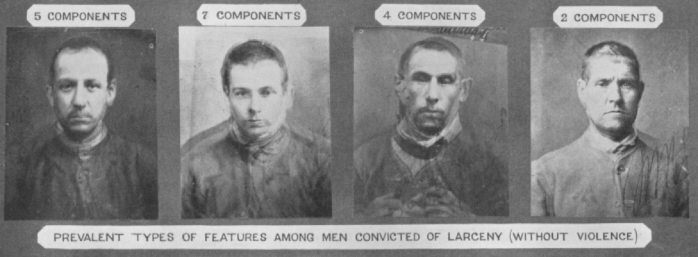
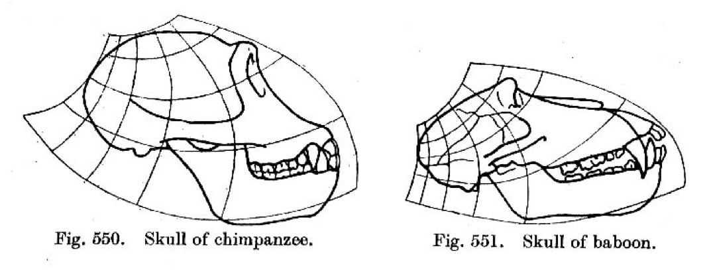
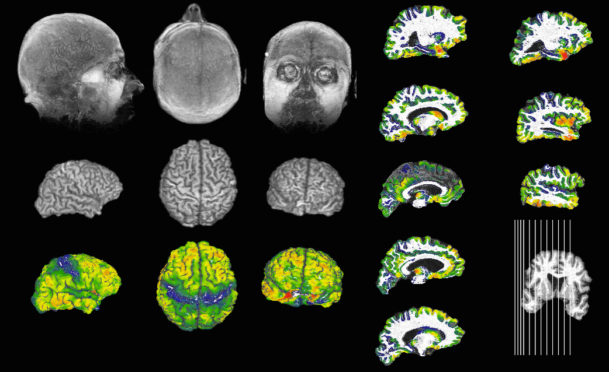
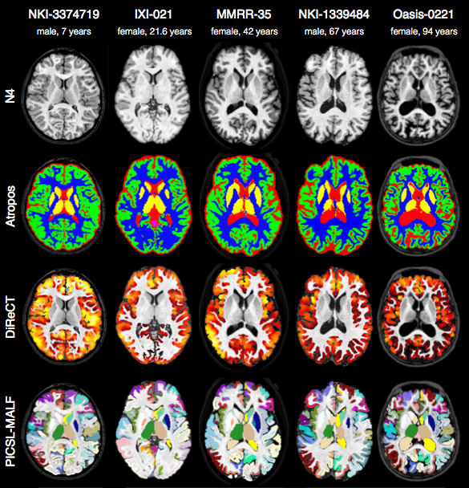
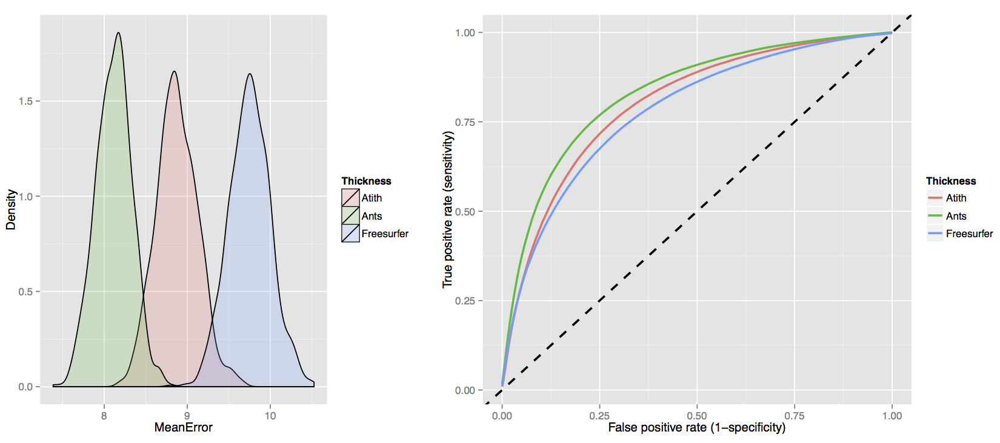

# Founding developers

##  Brian and Nick

<BR><BR>


<!--
NOtes:
* Worked together for almost 10 years
* have learned tons
* have written quite a bit of code together
-->

## ANTs long term collaborators


$+$ [neurodebian](http://neuro.debian.net/pkgs/ants.html), [slicer](http://www.slicer.org/), [brainsfit](https://github.com/BRAINSia/BRAINSTools), [nipype](http://nipy.sourceforge.net/nipype/), [itk](http://www.itk.org) and more ...

<!--
NOtes:
* However, it is not just us
* Other people have done quite a bit
* and others who are not shown such as Arman
-->
# ANTs lineage

## Image mapping and perception: 1877

Francis Galton: _Can we see criminality in the face?_



_What about syphilis, mental illness?_

<!--
Notes:
* Use of "composite portraiture" and what he called "eugenics"
* Can we see criminality, mental illness, syphilis, and others in facial features?
* Despite the obvious prejudices driving his research, he was a pioneer.
-->

<!--

##


-->

<!--
Notes:
* Another example where he has manually categorized facial features and try to combine them
* Did not find much---composite tends to blend away to normality.
-->

##  Speaking of criminality...

_Can we say anything about the U.S. Congress?_


__Maybe they should have used [ANTs](https://github.com/ntustison/CongressionalFaceTemplates)?__

<!--
Notes:
-->

##  Image mapping & biology:  1917

D'Arcy Thompson: _Comparison of related forms_


-->

<!--
Notes:
* Book: On Growth and Form
* Descriptive not susceptible to hypothesis testing
* "This book of mine has little need of preface, for indeed it is 'all preface' from beginning to end."
-->

## Image mapping & biology: Current
<BR><BR>
_Look where we are now!_
<BR><BR>


## ANTs family tree


<!--
References: @Horn1981, @Gee1993, @Grenander1993, @Thompson2001, @Miller2002, @Shen2002, @Arnold2014, @Thirion1998, @Rueckert1999, @Fischl2012, @Ashburner2012
-->

## Initial scope




<!--
Notes:
* Brian work with Murray Grossman
* First registration paper
  - WBIR submission
  - FEM registraiton using B-spline basis functions.
  - "yeah, that registration is not that good---Jim would not like it."
-->


# Major tools

## Donoho?

<BR><BR>
<span style="color:red;">_"Papers are just advertisements for the science."_</red>
<BR>

<!--

## Symmetric Normalization (SyN)

$\int_{t=0}^{0.5} \left(\|\mathbf{v}_1(x,t)\|_L^2 + \|\mathbf{v}_2(x,t)\|_L^2\right)dt + \|I\left(\phi_1(x,0.5)\right) - J_i\left(\phi_2(x,0.5)\right)\|^2$


NOtes:
* Previously discussed Brians work
* The variant most widely used
-->


## Diffeomorphisms:  Occam's razor modeling


_differentiable map with differentiable inverse_

## Diffeomoprhisms:  fine-grained and flexible maps


<!--

## Diffeomorphisms: image parameterization in a metric space


-->


## Beyond original SyN

\small


## ```antsRegistration```
<BR><BR>

```bash
$ antsRegistration --help

COMMAND:
     antsRegistration
          This program is a user-level registration application meant to utilize
          ITKv4-only classes. The user can specify any number of "stages" where a stage
          consists of a transform; an image metric; and iterations, shrink factors, and
          smoothing sigmas for each level.Note that dimensionality, metric, transform,
          output, convergence, shrink-factors and smoothing-sigmas parameters are
          mandatory.

OPTIONS:
     --version
          Get Version Information.

     -d, --dimensionality 2/3
          This option forces the image to be treated as a specified-dimensional image. If
          not specified, we try to infer the dimensionality from the input image.

     -o, --output outputTransformPrefix
                  [outputTransformPrefix,<outputWarpedImage>,<outputInverseWarpedImage>]
          Specify the output transform prefix (output format is .nii.gz ). Optionally, one
          can choose to warp the moving image to the fixed space and, if the inverse
          transform exists, one can also output the warped fixed image. Note that only the
          images specified in the first metric call are warped. Use antsApplyTransforms to
          warp other images using the resultant transform(s).

     -j, --save-state saveSateAsTransform
          Specify the output file for the current state of the registration. The state
          file is written to an hdf5 composite file. It is specially usefull if we want to
          save the current state of a SyN registration to the disk, so we can load and
          restore that later to continue the next registration process directly started
          from the last saved state. The output file of this flag is the same as the
          write-composite-transform, unless the last transform is a SyN transform. In that
          case, the inverse displacement field of the SyN transform is also added to the
          output composite transform. Again notice that this file cannot be treated as a
          transform, and restore-state option must be used to load the written file by
          this flag.

     -k, --restore-state restoreStateAsATransform
          Specify the initial state of the registration which get immediately used to
          directly initialize the registration process. The flag is mutually exclusive
          with other intialization flags.If this flag is used, none of the
          initial-moving-transform and initial-fixed-transform cannot be used.

     -a, --write-composite-transform 1/(0)
          Boolean specifying whether or not the composite transform (and its inverse, if
          it exists) should be written to an hdf5 composite file. This is false by default
          so that only the transform for each stage is written to file.
          <VALUES>: 0

     -p, --print-similarity-measure-interval <unsignedIntegerValue>
          Prints out the CC similarity metric measure between the full-size input fixed
          and the transformed moving images at each iteration a value of 0 (the default)
          indicates that the full scale computation should not take placeany value greater
          than 0 represents the interval of full scale metric computation.
          <VALUES>: 0

     -v, --write-interval-volumes <unsignedIntegerValue>
          Writes out the output volume at each iteration. It helps to present the
          registration process as a short movie a value of 0 (the default) indicates that
          this option should not take placeany value greater than 0 represents the
          interval between the iterations which outputs are written to the disk.
          <VALUES>: 0

     -z, --collapse-output-transforms (1)/0
          Collapse output transforms. Specifically, enabling this option combines all
          adjacent transforms wherepossible. All adjacent linear transforms are written to
          disk in the forman itk affine transform (called xxxGenericAffine.mat).
          Similarly, all adjacent displacement field transforms are combined when written
          to disk (e.g. xxxWarp.nii.gz and xxxInverseWarp.nii.gz (if available)).Also, an
          output composite transform including the collapsed transforms is written to the
          disk (called outputCollapsed(Inverse)Composite).
          <VALUES>: 1

     -i, --initialize-transforms-per-stage (1)/0
          Initialize linear transforms from the previous stage. By enabling this option,
          the current linear stage transform is directly intialized from the previous
          stage's linear transform; this allows multiple linear stages to be run where
          each stage directly updates the estimated linear transform from the previous
          stage. (e.g. Translation -> Rigid -> Affine).
          <VALUES>: 0

     -n, --interpolation Linear
                         NearestNeighbor
                         MultiLabel[<sigma=imageSpacing>,<alpha=4.0>]
                         Gaussian[<sigma=imageSpacing>,<alpha=1.0>]
                         BSpline[<order=3>]
                         CosineWindowedSinc
                         WelchWindowedSinc
                         HammingWindowedSinc
                         LanczosWindowedSinc
          Several interpolation options are available in ITK. These have all been made
          available. Currently the interpolator choice is only used to warp (and possibly
          inverse warp) the final output image(s).

     -g, --restrict-deformation PxQxR
          This option allows the user to restrict the optimization of the displacement
          field, translation, rigid or affine transform on a per-component basis. For
          example, if one wants to limit the deformation or rotation of 3-D volume to the
          first two dimensions, this is possible by specifying a weight vector of '1x1x0'
          for a deformation field or '1x1x0x1x1x0' for a rigid
          transformation.Low-dimensional restriction only works if there are no preceding
          transformations.

     -q, --initial-fixed-transform initialTransform
                                   [initialTransform,<useInverse>]
                                   [fixedImage,movingImage,initializationFeature]
          Specify the initial fixed transform(s) which get immediately incorporated into
          the composite transform. The order of the transforms is stack-esque in that the
          last transform specified on the command line is the first to be applied. In
          addition to initialization with ITK transforms, the user can perform an initial
          translation alignment by specifying the fixed and moving images and selecting an
          initialization feature. These features include using the geometric center of the
          images (=0), the image intensities (=1), or the origin of the images (=2).

     -r, --initial-moving-transform initialTransform
                                    [initialTransform,<useInverse>]
                                    [fixedImage,movingImage,initializationFeature]
          Specify the initial moving transform(s) which get immediately incorporated into
          the composite transform. The order of the transforms is stack-esque in that the
          last transform specified on the command line is the first to be applied. In
          addition to initialization with ITK transforms, the user can perform an initial
          translation alignment by specifying the fixed and moving images and selecting an
          initialization feature. These features include using the geometric center of the
          images (=0), the image intensities (=1), or the origin of the images (=2).

     -m, --metric CC[fixedImage,movingImage,metricWeight,radius,<samplingStrategy={None,Regular,Random}>,<samplingPercentage=[0,1]>]
                  MI[fixedImage,movingImage,metricWeight,numberOfBins,<samplingStrategy={None,Regular,Random}>,<samplingPercentage=[0,1]>]
                  Mattes[fixedImage,movingImage,metricWeight,numberOfBins,<samplingStrategy={None,Regular,Random}>,<samplingPercentage=[0,1]>]
                  MeanSquares[fixedImage,movingImage,metricWeight,radius=NA,<samplingStrategy={None,Regular,Random}>,<samplingPercentage=[0,1]>]
                  Demons[fixedImage,movingImage,metricWeight,radius=NA,<samplingStrategy={None,Regular,Random}>,<samplingPercentage=[0,1]>]
                  GC[fixedImage,movingImage,metricWeight,radius=NA,<samplingStrategy={None,Regular,Random}>,<samplingPercentage=[0,1]>]
                  ICP[fixedPointSet,movingPointSet,metricWeight,<samplingPercentage=[0,1]>,<boundaryPointsOnly=0>]
                  PSE[fixedPointSet,movingPointSet,metricWeight,<samplingPercentage=[0,1]>,<boundaryPointsOnly=0>,<pointSetSigma=1>,<kNeighborhood=50>]
                  JHCT[fixedPointSet,movingPointSet,metricWeight,<samplingPercentage=[0,1]>,<boundaryPointsOnly=0>,<pointSetSigma=1>,<kNeighborhood=50>,<alpha=1.1>,<useAnisotropicCovariances=1>]
                  IGDM[fixedImage,movingImage,metricWeight,fixedMask,movingMask,<neighborhoodRadius=0x0>,<intensitySigma=0>,<distanceSigma=0>,<kNeighborhood=1>,<gradientSigma=1>]
          These image metrics are available--- CC: ANTS neighborhood cross correlation,
          MI: Mutual information, Demons: (Thirion), MeanSquares, and GC: Global
          Correlation. The "metricWeight" variable is used to modulate the per stage
          weighting of the metrics. The metrics can also employ a sampling strategy
          defined by a sampling percentage. The sampling strategy defaults to 'None' (aka
          a dense sampling of one sample per voxel), otherwise it defines a point set over
          which to optimize the metric. The point set can be on a regular lattice or a
          random lattice of points slightly perturbed to minimize aliasing artifacts.
          samplingPercentage defines the fraction of points to select from the domain. In
          addition, three point set metrics are available: Euclidean (ICP), Point-set
          expectation (PSE), and Jensen-Havrda-Charvet-Tsallis (JHCT).

     -t, --transform Rigid[gradientStep]
                     Affine[gradientStep]
                     CompositeAffine[gradientStep]
                     Similarity[gradientStep]
                     Translation[gradientStep]
                     BSpline[gradientStep,meshSizeAtBaseLevel]
                     GaussianDisplacementField[gradientStep,updateFieldVarianceInVoxelSpace,totalFieldVarianceInVoxelSpace]
                     BSplineDisplacementField[gradientStep,updateFieldMeshSizeAtBaseLevel,totalFieldMeshSizeAtBaseLevel,<splineOrder=3>]
                     TimeVaryingVelocityField[gradientStep,numberOfTimeIndices,updateFieldVarianceInVoxelSpace,updateFieldTimeVariance,totalFieldVarianceInVoxelSpace,totalFieldTimeVariance]
                     TimeVaryingBSplineVelocityField[gradientStep,velocityFieldMeshSize,<numberOfTimePointSamples=4>,<splineOrder=3>]
                     SyN[gradientStep,updateFieldVarianceInVoxelSpace,totalFieldVarianceInVoxelSpace]
                     BSplineSyN[gradientStep,updateFieldMeshSizeAtBaseLevel,totalFieldMeshSizeAtBaseLevel,<splineOrder=3>]
                     Exponential[gradientStep,updateFieldVarianceInVoxelSpace,velocityFieldVarianceInVoxelSpace,<numberOfIntegrationSteps>]
                     BSplineExponential[gradientStep,updateFieldMeshSizeAtBaseLevel,velocityFieldMeshSizeAtBaseLevel,<numberOfIntegrationSteps>,<splineOrder=3>]
          Several transform options are available. The gradientStep or learningRate
          characterizes the gradient descent optimization and is scaled appropriately for
          each transform using the shift scales estimator. Subsequent parameters are
          transform-specific and can be determined from the usage. For the B-spline
          transforms one can also specify the smoothing in terms of spline distance (i.e.
          knot spacing).

     -c, --convergence MxNxO
                       [MxNxO,<convergenceThreshold=1e-6>,<convergenceWindowSize=10>]
          Convergence is determined from the number of iterations per level and is
          determined by fitting a line to the normalized energy profile of the last N
          iterations (where N is specified by the window size) and determining the slope
          which is then compared with the convergence threshold.

     -s, --smoothing-sigmas MxNxO...
          Specify the sigma of gaussian smoothing at each level. Units are given in terms
          of voxels ('vox') or physical spacing ('mm'). Example usage is '4x2x1mm' and
          '4x2x1vox' where no units implies voxel spacing.

     -f, --shrink-factors MxNxO...
          Specify the shrink factor for the virtual domain (typically the fixed image) at
          each level.

     -u, --use-histogram-matching
          Histogram match the images before registration.

     -l, --use-estimate-learning-rate-once
          turn on the option that lets you estimate the learning rate step size only at
          the beginning of each level. * useful as a second stage of fine-scale
          registration.

     -w, --winsorize-image-intensities [lowerQuantile,upperQuantile]
          Winsorize data based on specified quantiles.

     -x, --masks [fixedImageMask,movingImageMask]
          Image masks to limit voxels considered by the metric.

     --float
          Use 'float' instead of 'double' for computations.
          <VALUES>: 0

     -v, --verbose (0)/1
          Verbose output.

     -h
          Print the help menu (short version).

     --help
          Print the help menu. Will also print values used on the current command line
          call.
```

## Template building:  creating the average Joe


## "Attractiveness" $\rightarrow$ mental processing?


##  What about brains?


## Templates facilitate computation


## Gender discernibility?


## ```antsMultivariateTemplateConstruction2.sh```

```bash
$ antsMultivariateTemplateConstruction2.sh

Usage:

antsMultivariateTemplateConstruction2.sh -d ImageDimension -o OutputPrefix <other options> <images>

Compulsory arguments (minimal command line requires SGE/PBS cluster, otherwise use -c and
  -j options):

     -d:  ImageDimension: 2 or 3 (for 2 or 3 dimensional registration of single volume)
   ImageDimension: 4 (for template generation of time-series data)

     -o:  OutputPrefix; A prefix that is prepended to all output files.

<images>  List of images in the current directory, eg *_t1.nii.gz. Should be at the end
          of the command.  Optionally, one can specify a .csv or .txt file where each
          line is the location of the input image.  One can also specify more than
          one file for each image for multi-modal template construction (e.g. t1 and t2).
          For the multi-modal case, the templates will be consecutively numbered (e.g.
          template0.nii.gz, template1.nii.gz, ...).

NB: All images to be added to the template should be in the same directory, and this
    script should be invoked from that directory.

Optional arguments:

     -a   image statistic used to summarize images (default 1)
          0 = mean
          1 = mean of normalized intensities
          2 = median

     -b:  Backup images and results from all iterations (default = 0):  Boolean to save
          the transform files, bias corrected, and warped images for each iteration.

     -c:  Control for parallel computation (default 0):
          0 = run serially
          1 = SGE qsub
          2 = use PEXEC (localhost)
          3 = Apple XGrid
          4 = PBS qsub

     -e   use single precision ( default 1 )

     -g:  Gradient step size (default 0.25): smaller in magnitude results in more
          cautious steps.

     -i:  Iteration limit (default 4): iterations of the template construction
          (Iteration limit)*NumImages registrations.

     -j:  Number of cpu cores to use locally for pexec option (default 2; requires "-c 2")

     -k:  Number of modalities used to construct the template (default 1):  For example,
          if one wanted to create a multimodal template consisting of T1,T2,and FA
          components ("-k 3").

     -w:  Modality weights used in the similarity metric (default = 1): specified as
          e.g. 1x0.5x0.75.

     -q:  Max iterations for each pairwise registration (default = 100x100x70x20):
          specified in the form ...xJxKxL where
            J = max iterations at coarsest resolution (here, reduced by power of 2^2)
            K = middle resolution iterations (here, reduced by power of 2)
            L = fine resolution iteratioxns (here, full resolution).
          Finer resolutions take much more time per iteration than coarser resolutions.

     -f:  Shrink factors (default = 6x4x2x1):  Also in the same form as -q max iterations.
          Needs to have the same number of components.

     -s:  Smoothing factors (default = 3x2x1x0):  Also in the same form as -q max
          iterations.  Needs to have the same number of components.

     -n:  N4BiasFieldCorrection of moving image: 0 == off, 1 == on (default 1).

     -p:  Commands to prepend to job scripts (e.g., change into appropriate directory, set
          paths, etc)

     -r:  Do rigid-body registration of inputs before creating template (default 0):
          0 == off 1 == on. Only useful when you do not have an initial template

     -l:  Use linear image registration stages during the pairwise (template/subject)
          deformable registration.  Otherwise, registration is limited to SyN or
          B-spline SyN (see '-t' option).  This is '1' by default.

     -m:  Type of similarity metric used for registration (default = CC):  Options are
            CC = cross-correlation
            MI = mutual information
            MSQ = mean square difference
            DEMONS = demon's metric
          A similarity metric per modality can be specified.  If the CC metric is chosen,
          one can also specify the radius in brackets, e.g. '-m CC[4]'.

     -t:  Type of transformation model used for registration (default = SyN):  Options are
            SyN = Greedy SyN
            BSplineSyN = Greedy B-spline SyN
            TimeVaryingVelocityField = Time-varying velocity field
            TimeVaryingBSplineVelocityField = Time-varying B-spline velocity field

     -u:  Walltime (default = 20:00:00):  Option for PBS qsub specifying requested time
          per pairwise registration.

     -v:  Memory limit (default = 8gb):  Option for PBS qsub specifying requested memory
          per pairwise registration.

     -x:  XGrid arguments (e.g., -x "-p password -h controlhost")

     -y:  Update the template with the full affine transform (default 1). If 0, the rigid
          component of the affine transform will not be used to update the template. If your
          template drifts in translation or orientation try -y 0.

     -z:  Use this this volume as the target of all inputs. When not used, the script
          will create an unbiased starting point by averaging all inputs. Use the full
          path.
          For multiple modalities, specify -z modality1.nii.gz -z modality2.nii.gz ...
          in the same modality order as the input images.

Example:

antsMultivariateTemplateConstruction2.sh -d 3 -i 3 -k 1 -f 4x2x1 -s 2x1x0vox -q 30x20x4 -t SyN  -m CC -c 0 -o MY sub*avg.nii.gz

Multimodal example:

antsMultivariateTemplateConstruction2.sh -d 3 -i 3 -k 2 -f 4x2x1 -s 2x1x0vox -q 30x20x4 -t SyN -z t1.nii.gz -z t2.nii.gz  -m CC -c 0 -o MY templateInput.csv

where templateInput.csv contains

subjectA_t1.nii.gz,subjectA_t2.nii.gz
subjectB_t1.nii.gz,subjectB_t2.nii.gz
...

--------------------------------------------------------------------------------------
ANTS was created by:
--------------------------------------------------------------------------------------
Brian B. Avants, Nick Tustison and Gang Song
Penn Image Computing And Science Laboratory
University of Pennsylvania

Please reference http://www.ncbi.nlm.nih.gov/pubmed/20851191 when employing this script
in your studies. A reproducible evaluation of ANTs similarity metric performance in
brain image registration:

* Avants BB, Tustison NJ, Song G, Cook PA, Klein A, Gee JC. Neuroimage, 2011.

Also see http://www.ncbi.nlm.nih.gov/pubmed/19818860 for more details.

The script has been updated and improved since this publication.

--------------------------------------------------------------------------------------
Script by Nick Tustison
--------------------------------------------------------------------------------------
Apple XGrid support by Craig Stark
--------------------------------------------------------------------------------------
```

<!--

## Nonparametric nonuniform intensity normalization (N3)

* Developed at the Montreal Neurological Institute (John Sled, 1998)

* Part of the standard preprocessing protocol in large scale projects such as ADNI

* The traditional de facto standard in MRI bias correction
    + good performance
    + *public availability*

* Public availability --- set of perl scripts coordinating various C++ programs

* "*Let's incorporate N3 into ANTs!*"
-->

## N3 adoption issues


<div align="center"></img></div>

<!--

## N4

* comparative [evaluation](http://www.ncbi.nlm.nih.gov/pubmed/20378467)

* small spline distances (useful for higher magnet strengths)

* multiresolution

* weighted regional mask (used in [`antsAtroposN4.sh`](https://github.com/stnava/ANTs/blob/master/Scripts/antsAtroposN4.sh))

* fast execution times

* _publicly available_

* tested nightly within the ITK dashboard system
-->

## ```N4BiasFieldCorrection```

```bash
$ N4BiasFieldCorrection --help

COMMAND:
     N4BiasFieldCorrection
          N4 is a variant of the popular N3 (nonparameteric nonuniform normalization)
          retrospective bias correction algorithm. Based on the assumption that the
          corruption of the low frequency bias field can be modeled as a convolution of
          the intensity histogram by a Gaussian, the basic algorithmic protocol is to
          iterate between deconvolving the intensity histogram by a Gaussian, remapping
          the intensities, and then spatially smoothing this result by a B-spline modeling
          of the bias field itself. The modifications from and improvements obtained over
          the original N3 algorithm are described in the following paper: N. Tustison et
          al., N4ITK: Improved N3 Bias Correction, IEEE Transactions on Medical Imaging,
          29(6):1310-1320, June 2010.

OPTIONS:
     -d, --image-dimensionality 2/3/4
          This option forces the image to be treated as a specified-dimensional image. If
          not specified, N4 tries to infer the dimensionality from the input image.

     -i, --input-image inputImageFilename
          A scalar image is expected as input for bias correction. Since N4 log transforms
          the intensities, negative values or values close to zero should be processed
          prior to correction.

     -x, --mask-image maskImageFilename
          If a mask image is specified, the final bias correction is only performed in the
          mask region. If a weight image is not specified, only intensity values inside
          the masked region are used during the execution of the algorithm. If a weight
          image is specified, only the non-zero weights are used in the execution of the
          algorithm although the mask region defines where bias correction is performed in
          the final output. Otherwise bias correction occurs over the entire image domain.
          See also the option description for the weight image.

     -r, --rescale-intensities 0/(1)
          At each iteration, a new intensity mapping is calculated and applied but there
          is nothing which constrains the new intensity range to be within certain values.
          The result is that the range can "drift" from the original at each iteration.
          This option rescales to the [min,max] range of the original image intensities
          within the user-specified mask.

     -w, --weight-image weightImageFilename
          The weight image allows the user to perform a relative weighting of specific
          voxels during the B-spline fitting. For example, some studies have shown that N3
          performed on white matter segmentations improves performance. If one has a
          spatial probability map of the white matter, one can use this map to weight the
          b-spline fitting towards those voxels which are more probabilistically
          classified as white matter. See also the option description for the mask image.

     -s, --shrink-factor 1/2/3/4/...
          Running N4 on large images can be time consuming. To lessen computation time,
          the input image can be resampled. The shrink factor, specified as a single
          integer, describes this resampling. Shrink factors <= 4 are commonly used.

     -c, --convergence [<numberOfIterations=50x50x50x50>,<convergenceThreshold=0.0>]
          Convergence is determined by calculating the coefficient of variation between
          subsequent iterations. When this value is less than the specified threshold from
          the previous iteration or the maximum number of iterations is exceeded the
          program terminates. Multiple resolutions can be specified by using 'x' between
          the number of iterations at each resolution, e.g. 100x50x50.

     -b, --bspline-fitting [splineDistance,<splineOrder=3>]
                           [initialMeshResolution,<splineOrder=3>]
          These options describe the b-spline fitting parameters. The initial b-spline
          mesh at the coarsest resolution is specified either as the number of elements in
          each dimension, e.g. 2x2x3 for 3-D images, or it can be specified as a single
          scalar parameter which describes the isotropic sizing of the mesh elements. The
          latter option is typically preferred. For each subsequent level, the spline
          distance decreases in half, or equivalently, the number of mesh elements doubles
          Cubic splines (order = 3) are typically used.

     -t, --histogram-sharpening [<FWHM=0.15>,<wienerNoise=0.01>,<numberOfHistogramBins=200>]
          These options describe the histogram sharpening parameters, i.e. the
          deconvolution step parameters described in the original N3 algorithm. The
          default values have been shown to work fairly well.

     -o, --output correctedImage
                  [correctedImage,<biasField>]
          The output consists of the bias corrected version of the input image.
          Optionally, one can also output the estimated bias field.

     --version
          Get Version Information.

     -v, --verbose (0)/1
          Verbose output.

     -h
          Print the help menu (short version).

     --help
          Print the help menu.
          <VALUES>: 1
```

<--
##  Atropos -- cutting the threads of fate


-->

<!--
Notes:
* Can we use Suyash's code?
* What about graph cuts?
-->

## Atropos:  flexible code base

"20+ years of development.  <br>_Show me the code!_"


## ```Atropos```

```bash
$ Atropos --help

COMMAND:
     Atropos
          A finite mixture modeling (FMM) segmentation approach with possibilities for
          specifying prior constraints. These prior constraints include the specification
          of a prior label image, prior probability images (one for each class), and/or an
          MRF prior to enforce spatial smoothing of the labels. Similar algorithms include
          FAST and SPM. Reference: Avants BB, Tustison NJ, Wu J, Cook PA, Gee JC. An open
          source multivariate framework for n-tissue segmentation with evaluation on
          public data. Neuroinformatics. 2011 Dec;9(4):381-400.

OPTIONS:
     -d, --image-dimensionality 2/3/4
          This option forces the image to be treated as a specified-dimensional image. If
          not specified, Atropos tries to infer the dimensionality from the first input
          image.

     -a, --intensity-image [intensityImage,<adaptiveSmoothingWeight>]
          One or more scalar images is specified for segmentation using the
          -a/--intensity-image option. For segmentation scenarios with no prior
          information, the first scalar image encountered on the command line is used to
          order labelings such that the class with the smallest intensity signature is
          class '1' through class 'N' which represents the voxels with the largest
          intensity values. The optional adaptive smoothing weight parameter is applicable
          only when using prior label or probability images. This scalar parameter is to
          be specified between [0,1] which smooths each labeled region separately and
          modulates the intensity measurement at each voxel in each intensity image
          between the original intensity and its smoothed counterpart. The smoothness
          parameters are governed by the -b/--bspline option.

     -b, --bspline [<numberOfLevels=6>,<initialMeshResolution=1x1x...>,<splineOrder=3>]
          If the adaptive smoothing weights are > 0, the intensity images are smoothed in
          calculating the likelihood values. This is to account for subtle intensity
          differences across the same tissue regions.

     -i, --initialization Random[numberOfClasses]
                          Otsu[numberOfTissueClasses]
                          KMeans[numberOfTissueClasses,<clusterCenters(in ascending order and for first intensity image only)>]
                          PriorProbabilityImages[numberOfTissueClasses,fileSeriesFormat(index=1 to numberOfClasses) or vectorImage,priorWeighting,<priorProbabilityThreshold>]
                          PriorLabelImage[numberOfTissueClasses,labelImage,priorWeighting]
          To initialize the FMM parameters, one of the following options must be
          specified. If one does not have prior label or probability images we recommend
          using kmeans as it is typically faster than otsu and can be used with
          multivariate initialization. However, since a Euclidean distance on the inter
          cluster distances is used, one might have to appropriately scale the additional
          input images. Random initialization is meant purely for intellectual curiosity.
          The prior weighting (specified in the range [0,1]) is used to modulate the
          calculation of the posterior probabilities between the likelihood*mrfprior and
          the likelihood*mrfprior*prior. For specifying many prior probability images for
          a multi-label segmentation, we offer a minimize usage option (see -m). With that
          option one can specify a prior probability threshold in which only those pixels
          exceeding that threshold are stored in memory.

     -s, --partial-volume-label-set label1xlabel2xlabel3
          The partial volume estimation option allows one to modelmixtures of classes
          within single voxels. Atropos currently allows the user to model two class
          mixtures per partial volume class. The user specifies a set of class labels per
          partial volume class requested. For example, suppose the user was performing a
          classic 3-tissue segmentation (csf, gm, wm) using kmeans initialization. Suppose
          the user also wanted to model the partial voluming effects between csf/gm and
          gm/wm. The user would specify it using -i kmeans[3] and -s 1x2 -s 2x3. So, for
          this example, there would be 3 tissue classes and 2 partial volume classes.
          Optionally,the user can limit partial volume handling to mrf considerations only
          whereby the output would only be the three tissues.

     --use-partial-volume-likelihoods 1/(0)
                                      true/(false)
          The user can specify whether or not to use the partial volume likelihoods, in
          which case the partial volume class is considered separate from the tissue
          classes. Alternatively, one can use the MRF only to handle partial volume in
          which case, partial volume voxels are not considered as separate classes.

     -p, --posterior-formulation Socrates[<useMixtureModelProportions=1>,<initialAnnealingTemperature=1>,<annealingRate=1>,<minimumTemperature=0.1>]
                                 Plato[<useMixtureModelProportions=1>,<initialAnnealingTemperature=1>,<annealingRate=1>,<minimumTemperature=0.1>]
                                 Aristotle[<useMixtureModelProportions=1>,<initialAnnealingTemperature=1>,<annealingRate=1>,<minimumTemperature=0.1>]
                                 Sigmoid[<useMixtureModelProportions=1>,<initialAnnealingTemperature=1>,<annealingRate=1>,<minimumTemperature=0.1>]]
          Different posterior probability formulations are possible as are different
          update options. To guarantee theoretical convergence properties, a proper
          formulation of the well-known iterated conditional modes (ICM) uses an
          asynchronous update step modulated by a specified annealing temperature. If one
          sets the AnnealingTemperature > 1 in the posterior formulation a traditional
          code set for a proper ICM update will be created. Otherwise, a synchronous
          update step will take place at each iteration. The annealing temperature, T,
          converts the posteriorProbability to posteriorProbability^(1/T) over the course
          of optimization.

     -x, --mask-image maskImageFilename
          The image mask (which is required) defines the region which is to be labeled by
          the Atropos algorithm.

     -c, --convergence numberOfIterations
                       [<numberOfIterations=5>,<convergenceThreshold=0.001>]
          Convergence is determined by calculating the mean maximum posterior probability
          over the region of interest at each iteration. When this value decreases or
          increases less than the specified threshold from the previous iteration or the
          maximum number of iterations is exceeded the program terminates.

     -k, --likelihood-model Gaussian
                            HistogramParzenWindows[<sigma=1.0>,<numberOfBins=32>]
                            ManifoldParzenWindows[<pointSetSigma=1.0>,<evaluationKNeighborhood=50>,<CovarianceKNeighborhood=0>,<kernelSigma=0>]
                            JointShapeAndOrientationProbability[<shapeSigma=1.0>,<numberOfShapeBins=64>, <orientationSigma=1.0>, <numberOfOrientationBins=32>]
                            LogEuclideanGaussian
          Both parametric and non-parametric options exist in Atropos. The Gaussian
          parametric option is commonly used (e.g. SPM & FAST) where the mean and standard
          deviation for the Gaussian of each class is calculated at each iteration. Other
          groups use non-parametric approaches exemplified by option 2. We recommend using
          options 1 or 2 as they are fairly standard and the default parameters work
          adequately.

     -m, --mrf [<smoothingFactor=0.3>,<radius=1x1x...>]
               [<mrfCoefficientImage>,<radius=1x1x...>]
          Markov random field (MRF) theory provides a general framework for enforcing
          spatially contextual constraints on the segmentation solution. The default
          smoothing factor of 0.3 provides a moderate amount of smoothing. Increasing this
          number causes more smoothing whereas decreasing the number lessens the
          smoothing. The radius parameter specifies the mrf neighborhood. Different update
          schemes are possible but only the asynchronous updating has theoretical
          convergence properties.

     -g, --icm [<useAsynchronousUpdate=1>,<maximumNumberOfICMIterations=1>,<icmCodeImage=''>]
          Asynchronous updating requires the construction of an ICM code image which is a
          label image (with labels in the range {1,..,MaximumICMCode}) constructed such
          that no MRF neighborhood has duplicate ICM code labels. Thus, to update the
          voxel class labels we iterate through the code labels and, for each code label,
          we iterate through the image and update the voxel class label that has the
          corresponding ICM code label. One can print out the ICM code image by specifying
          an ITK-compatible image filename.

     -r, --use-random-seed 0/(1)
          Initialize internal random number generator with a random seed. Otherwise,
          initialize with a constant seed number.

     -o, --output [classifiedImage,<posteriorProbabilityImageFileNameFormat>]
          The output consists of a labeled image where each voxel in the masked region is
          assigned a label from 1, 2, ..., N. Optionally, one can also output the
          posterior probability images specified in the same format as the prior
          probability images, e.g. posterior%02d.nii.gz (C-style file name formatting).

     -u, --minimize-memory-usage (0)/1
          By default, memory usage is not minimized, however, if this is needed, the
          various probability and distance images are calculated on the fly instead of
          being stored in memory at each iteration. Also, if prior probability images are
          used, only the non-negligible pixel values are stored in memory.
          <VALUES>: 0

     -w, --winsorize-outliers BoxPlot[<lowerPercentile=0.25>,<upperPercentile=0.75>,<whiskerLength=1.5>]
                              GrubbsRosner[<significanceLevel=0.05>,<winsorizingLevel=0.10>]
          To remove the effects of outliers in calculating the weighted mean and weighted
          covariance, the user can opt to remove the outliers through the options
          specified below.

     -e, --use-euclidean-distance (0)/1
          Given prior label or probability images, the labels are propagated throughout
          the masked region so that every voxel in the mask is labeled. Propagation is
          done by using a signed distance transform of the label. Alternatively,
          propagation of the labels with the fast marching filter respects the distance
          along the shape of the mask (e.g. the sinuous sulci and gyri of the cortex.
          <VALUES>: 0

     -l, --label-propagation whichLabel[lambda=0.0,<boundaryProbability=1.0>]
          The propagation of each prior label can be controlled by the lambda and boundary
          probability parameters. The latter parameter is the probability (in the range
          [0,1]) of the label on the boundary which increases linearly to a maximum value
          of 1.0 in the interior of the labeled region. The former parameter dictates the
          exponential decay of probability propagation outside the labeled region from the
          boundary probability, i.e. boundaryProbability*exp( -lambda * distance ).

     -v, --verbose (0)/1
          Verbose output.

     -h
          Print the help menu (short version).

     --help
          Print the help menu.
          <VALUES>: 1
```

<!--


## Atropos + N4 $\rightarrow$ `antsAtroposN4.sh`


-->

# Putting it all together---the ANTs cortical thickness pipeline

## Cortical thickness studies

```{r, results='asis', echo = FALSE}
conditions <- c( "Tetris-playing ability", "Huntington’s disease", "schizophrenia", "bipolar disorder",
                 "Alzheimer’s disease", "frontotemporal dementia", "Parkinson’s disease",
                 "Williams syndrome", "multiple sclerosis", "autism", "migraines",
                 "chronic smoking", "alcoholism", "cocaine addiction", "Tourette syndrome in children",
                 "scoliosis in female adolescents", "early-onset blindness", "chronic pancreatitis",
                 "obsessive-compulsive disorder", "ADHD", "obesity", "heritable depression",
                 "elderly depression", "age", "gender",
                 "handedness", "intelligence", "athletic ability", "meditative practices", "musical ability",
                 "tendency toward criminality", "childhood sexual abuse in female adolescents",
                  "traumatic brain injury", "untreated male-to-female transsexuality" )

conditionsDF <- data.frame( Column1 = conditions[1:floor( 0.5*length(conditions) )], Column2 = conditions[( 1+floor( 0.5*length(conditions) ) ):length(conditions)] )
knitr::kable( conditionsDF )
```

<!--

## ANTs-related background

* Sandy, Brian, and <span style="color:red;">DiReCT</span>
    + used other tools such as FMRIB Automated Segmentation Tool (FAST)
    + `KellySlater.cxx`
* pipedream scripts "adequate for Penn data."
* `KellyKapowski.cxx` and `antsCorticalThickness.sh`
* _"Let's evaluate on open data."_
* and, eventually, _"Let's compare with FreeSurfer."_
-->

## Basic components of the pipeline

1. template building (offline)
2. brain extraction
3. cortical thickness estimation
4. cortical parcellation

## Sample results




## The ANTs structural brain mapping workflow


## Template building

*Tailor data to your specific cohort*


<!--
* Templates representing the average mean shape and intensity are built directly from the cohort to be analyzed, e.g. pediatric vs. middle-aged brains.
* Acquisition and anonymization (e.g. defacing) protocols are often different.
-->

## Template priors


<!--
Each template is [processed](https://github.com/ntustison/antsCookTemplatePriorsExample)
to produce auxiliary images which are used for brain extraction and brain segmentation.
-->

<!--


## Brain extraction comparison


Comparison with de facto standard FreeSurfer package.  Note the difference in separation of
the gray matter from the surrounding CSF.  (0 failures out of 1205 scans)
-->

<!--

## Brain segmentation


Randomly selected healthy individuals.  ```Atropos``` gets good performance across ages.
-->

## Cortical thickness estimation


<!--
In contrast to FreeSurfer which warps coupled surface meshes to segment the gray matter, *ANTs* diffeomorphically registers the white matter to the combined gray/white matters while simultaneously estimating thickness.
-->

## _But without ground truth, how does one evaluate the pipeline?_


## Predict age and gender

$AGE \sim VOLUME + GENDER + \sum_{i=1}^{62} T(DKT_i)$

## Open science principles


<!--
* Public data sets (IXI, NKI, OASIS, MMRR)
* $>$ 1200 subjects, age 4 to over 94 years old
-->

## Prediction from cortical thickness data


## Age prediction per site


## Regional importance comparison


ANTs (left) vs. FreeSurfer (right)

## Regional measurements


# But, wait, there's more!

##

[__Data availability__](https://github.com/ntustison/KapowskiChronicles)

*  "_Hey, can I have the FreeSurfer measurements for the entorhinal cortex?_"  Sure, why not?

*  "_I was wondering if you would make available the CT in each ROI for each subject..._" Sure, why not?  Would you also like the surface areas and volumes?

*  "_Can I have one or more of the templates that you used for your study?_" Would you like the priors as well?

##  What about using both the T1 & T2?

## ANTs tools are multivariate


## Arno-thick-in-the-head (ATITH)

_What if we made a crude estimate of the cortical thickness?_

$$thickness_{ROI} = \frac{volume_{ROI}}{area_{ROI}}$$

## Make sure you estimate the [surface area](http://www.insight-journal.org/browse/publication/852) correctly!


## So how does ATITH compare with ANTs, FS?

## Prediction from cortical thickness data



## Brain constellation maps


## _Does [denoising](http://www.ncbi.nlm.nih.gov/pubmed/20027588) help?_

## Contribution from Jose

```bash
$ DenoiseImage

COMMAND:
     DenoiseImage
          Denoise an image using a spatially adaptive filter originally described in J. V.
          Manjon, P. Coupe, Luis Marti-Bonmati, D. L. Collins, and M. Robles. Adaptive
          Non-Local Means Denoising of MR Images With Spatially Varying Noise Levels,
          Journal of Magnetic Resonance Imaging, 31:192-203, June 2010.

OPTIONS:
     -d, --image-dimensionality 2/3/4
          This option forces the image to be treated as a specified-dimensional image. If
          not specified, the program tries to infer the dimensionality from the input
          image.

     -i, --input-image inputImageFilename
          A scalar image is expected as input for noise correction.

     -n, --noise-model (Rician)/Gaussian
          Employ a Rician or Gaussian noise model.

     -s, --shrink-factor (1)/2/3/...
          Running noise correction on large images can be time consuming. To lessen
          computation time, the input image can be resampled. The shrink factor, specified
          as a single integer, describes this resampling. Shrink factor = 1 is the
          default.

     -o, --output correctedImage
                  [correctedImage,<noiseImage>]
          The output consists of the noise corrected version of the input image.
          Optionally, one can also output the estimated noise image.

     --version
          Get Version Information.

     -v, --verbose (0)/1
          Verbose output.

     -h
          Print the help menu (short version).

     --help
          Print the help menu.
```

## _Does [denoising](http://www.ncbi.nlm.nih.gov/pubmed/20027588) help?_


# But the best part is ...

## it is absolutely free!

```bash
${ANTSPATH}/antsCorticalThickness.sh \
  -a IXI/T1/IXI002-Guys-0828-T1.nii.gz \
  -e IXI/template/T_template0.nii.gz \
  -m IXI/template/T_template0ProbabilityMask.nii.gz \
  -f IXI/template/T_template0ExtractionMask.nii.gz \
  -p IXI/template/Priors/priors%d.nii.gz \
  -o IXI/ANTsResults/IXI002-Guys-0828-
```


# Joint label/intensity fusion

## Multi-atlas labeling


## Multi-atlas segmentation


## Multi-atlas 2012 results


## New work:  joint intensity fusion


<!--

## Possible uses

* ``Correct'' images
    * motion correction
    * lesions
* Project atlas set intensity signature
-->


