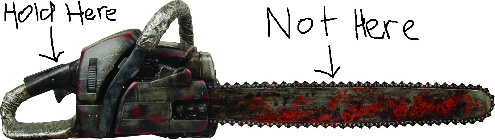
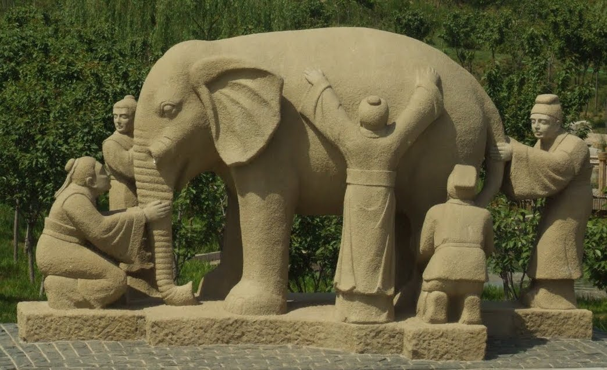
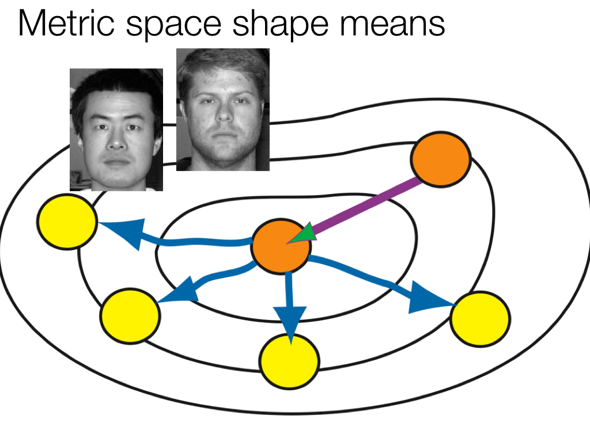
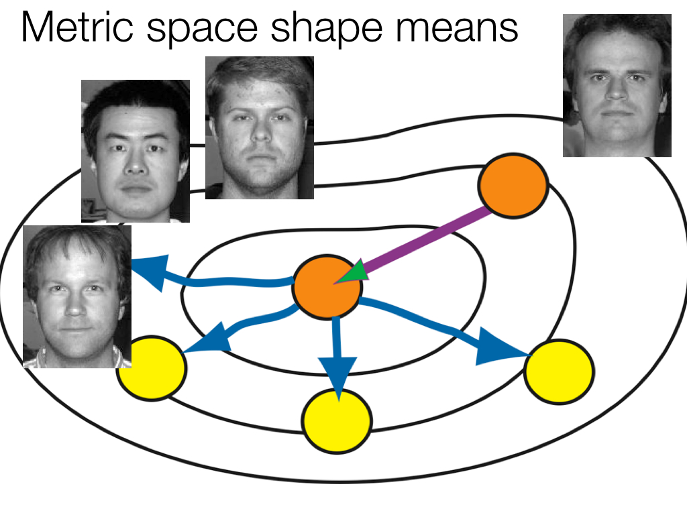
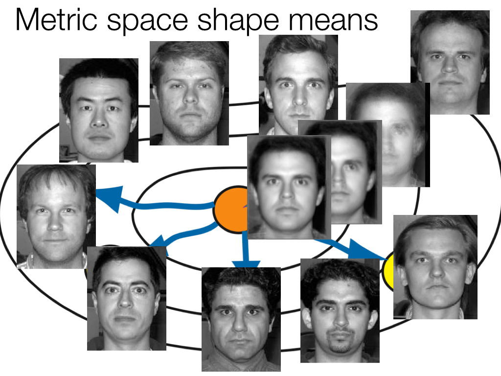
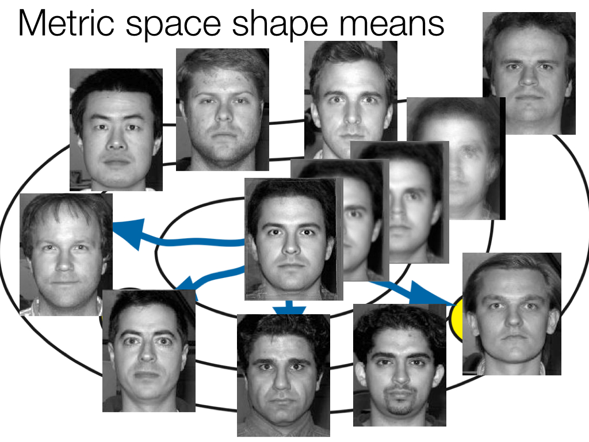
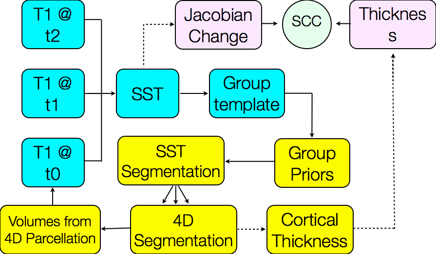
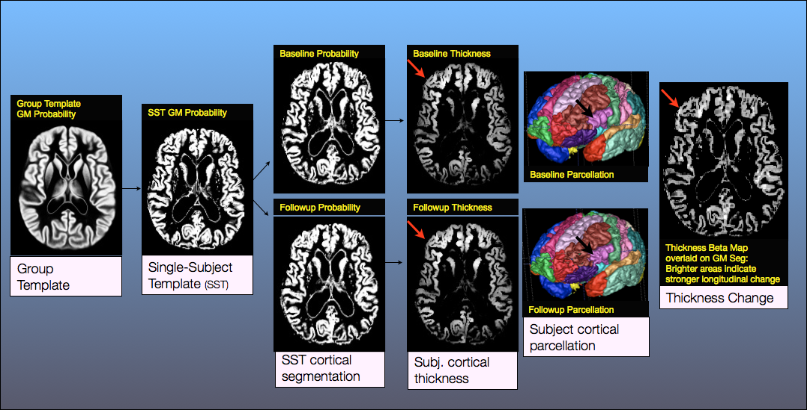

```{r global options, include=FALSE}
library(rmarkdown)
library(knitr)
figpath<-'figures/'
opts_chunk$set(fig.width=9, fig.height=6, fig.path=figpath,
               warning=FALSE, message=FALSE)
```


## 

<div align="center"></img></div>

This talk is online at [http://stnava.github.io/ANTs2015/](http://stnava.github.io/ANTs2015/) with colored [links](http://stnava.github.io/ANTs2015/) meant to be clicked for more information.

# Background

## Founding developers

<div align="center"></img></div>

BBA & NT

## Long-term collaborators


$+$ [neurodebian](http://neuro.debian.net/pkgs/ants.html), [slicer](http://www.slicer.org/), [brainsfit](https://github.com/BRAINSia/BRAINSTools), [nipype](http://nipy.sourceforge.net/nipype/), [itk](http://www.itk.org) and more ...


## 


a pride: common way of doing things

... in a competitive world ...

## Definitions

* Registration $=$ estimate an "optimal" geometric mapping between image pairs or image sets (e.g. Affine)

* <span style="color:grey;"> Similarity $=$ a function relating one image to another, given a transformation (e.g. mutual information)</span>

* Diffeomorphisms $=$ differentiable map with differentiable inverse (e.g. "silly putty", viscous fluid)  

* <span style="color:grey;">Segmentation $=$ labeling tissue or anatomy in images, usually automated (e.g. K-means)</span>

* Multivariate $=$ using many voxels or measurements at once (e.g. PCA, $p >> n$ ridge regression)</span>

* <span style="color:grey;">Multiple modality $=$ using many modalities at once (e.g. DTI and T1 and BOLD)</span>

* MALF: multi-atlas label fusion - using anatomical dictionaries to label new data

* <span style="color:grey;">Solutions to challenging statistical image processing problems usually need elements from each of the above</span> 


## Image mapping & perception: 1878


* Francis Galton: Can we see criminality in the face?

* (maybe he should have used ANTs?)


## Initial scope


... just do a better registration (tell story) ...

## ANTs Lineage 


References: @Horn1981, @Gee1993, @Grenander1993, @Thompson2001, @Miller2002, @Shen2002, @Arnold2014, @Thirion1998, @Rueckert1999, @Fischl2012, @Ashburner2012

## Diffeomorphisms

<div align="center"></img></div>

plausible physical modeling of large, invertible deformations

"differentiable map with differentiable inverse"

## Fine-grained and flexible maps


... to correct a misconception about diffeomorphisms ...


## General purpose library for multivariate image registration, segmentation & statistical analysis tools

* 170,000+ lines of C++, 6$+$ years of work, 15+ collaborators. 

* Generic mathematical methods that are tunable for 
application specific domains:  no-free lunch

* Deep testing on multiple platforms ... osx, linux, windows.

* Several "wins" in public knock-abouts ( [Klein 2009](http://www.ncbi.nlm.nih.gov/pubmed/19195496), [Murphy 2011](http://www.ncbi.nlm.nih.gov/pubmed/21632295), [SATA 2012 and 2013](http://www.ncbi.nlm.nih.gov/pmc/articles/PMC3837555/), [BRATS 2013](http://martinos.org/qtim/miccai2013/proc_brats_2013.pdf), others ) 

```
    An algorithm must use prior knowledge about a problem 
    to do well on that problem 
```

## ANTs: Beyond Registration


[Atropos](http://www.ncbi.nlm.nih.gov/pubmed/?term=atropos+tustison) segmentation, [N4 inhomogeneity correction](http://www.ncbi.nlm.nih.gov/pubmed/?term=N4+tustison), [Eigenanatomy](http://www.ncbi.nlm.nih.gov/pubmed/?term=eigenanatomy+avants), [SCCAN](http://www.ncbi.nlm.nih.gov/pubmed/?term=sparse+canonical+avants), [Prior-constrained PCA](http://www.ncbi.nlm.nih.gov/pubmed/24852460), and [atlas-based label fusion](http://www.ncbi.nlm.nih.gov/pmc/articles/PMC4009425/) and [MALF](http://www.ncbi.nlm.nih.gov/pubmed/21237273) (powerful expert systems for segmentation)

```

## On documentation


simple and nearly self-explanatory

## On documentation



documentation is important

## On documentation



... developers can be blind to doc deficiencies

while users are blind to what we provide!

# ANTs Impact

## ANTs Statistics


## ANTs & Neuroscience

We need statistical image analysis <br />at several scales in modern neuroscience

* Macro: *in vivo* structural and functional MRI

* Micro:  high-resolution post-mortem MRI links with in vivo MRI

* Nano: neuron reconstruction ...

* Solutions that are consistent across these scales have the potential
to build multi-scale feature sets or templates and provide new
insights into brain structure and function

* E.g. Parcellation constraints based on histology, tractography, function ...

* Statistical definitions of anatomy/pathology?  

* Reinvention of these solutions within each lab ... can we mitigate this?

* Reduce, reuse, recycle ...

## Financial impact

* The **high error rate** in software makes testing for quality assurance critically important. 

* Bugs exist **Everywhere**: so don't freak out if we admit we have bugs:  we're just being honest ( and not all devs are )

* Virtually every business in the United States now depends on software for development, production, distribution, and after-sales support of products and services.

* A 2002 NIST study estimated the direct costs to the software supply chain due to failure to identify (**successfully test for**) "bugs" 

* We are better at this than most ... **not perfect**

* The estimate of direct costs compiled from industry survey data for the U.S. economy was **\$60 billion per year**

* ... this estimate did not include costs to end users such as lost business (for example, the cost of shutting down the New York Mercantile Exchange in 1998 due to a software failure).

## ANTs: Saving society \$\$\$

starting with neuroscience ...


# Optimal Templates

## "Optimal" templates (?)

* unbiased wrt measurement space 

* space is non-linear: reference matters

* encodes prior information: still just averages (usually)

* concept extends across modalities, anatomy, temporality, etc

## Faces, brains, whatever ... 


## Faces, brains, whatever ... 


## Faces, brains, whatever ... 



## Faces, brains, whatever ... 


## Faces, brains, whatever ... 



## Faces, brains, whatever ... 


## Faces, brains, whatever ... 


## Faces, brains, whatever ... 


## Faces, brains, whatever ... 


## Faces, brains, whatever ... 


## Faces, brains, whatever ... 


## Faces, brains, whatever ... 


## Faces, brains, whatever ... 



## Faces, brains, whatever ... 


## Faces, brains, whatever ... 



## Faces, brains, whatever ... 


## Faces, brains, whatever ... 


see [ANTs site](stnava.github.io/ANTs) and [ANTs Documentation page](stnava.github.io/ANTsDoc)

## Templates from ANTs Colleagues ( not us )


# Evaluation

## 


# Longitudinal processing with ANTs

## ANTs longitudinal pipeline



see [link to paper](http://link.springer.com/chapter/10.1007/978-3-642-15705-9_40) 

and [unbiased analysis paper](http://www.ncbi.nlm.nih.gov/pubmed/20005963)

plus [longitudinal recommendation paper](http://www.ncbi.nlm.nih.gov/pmc/articles/PMC3581852/)

## ANTs longitudinal pipeline




# Cortical thickness with lesions

## antsCorticalThickness.sh is adaptable!

1. Register subject (or single subject template) to normal template.

2. Transform lesion mask to normal template.

3. Create additional "lesion" prior, i.e. ```SmoothImage 3 ${lesionMask} 1 ${lesionPrior} 1```.

4.  Subtract out lesion prior from all other priors and keep values $\in [0,1]$.

## Modified template spatial priors


## antsCorticalThickness.sh using lesion prior


Only change to the command call is an additional '-c WM[7]' which means "combine
the 7<sup>th</sup> prior, i.e. lesion, to the white matter for cortical thickness calculation."


# References

