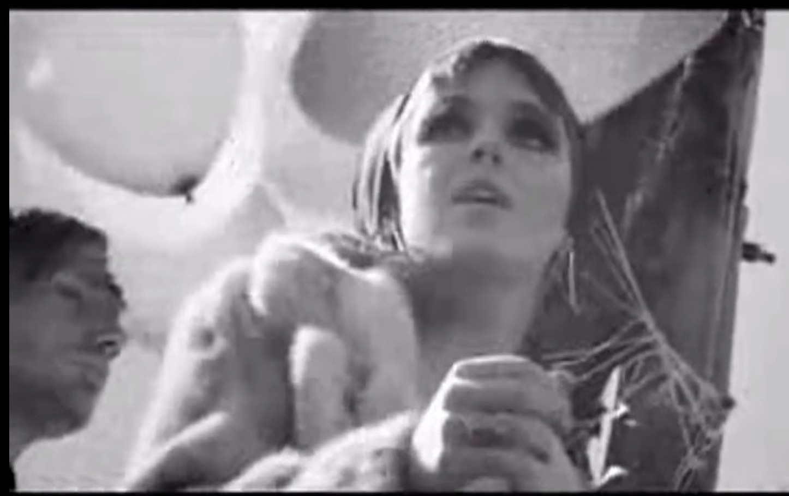
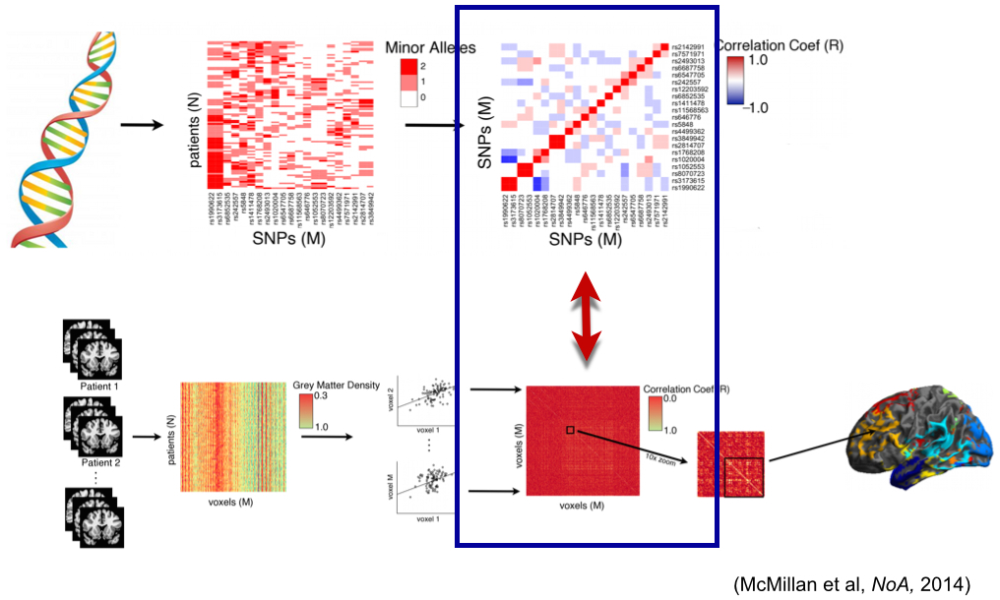

```{r global options, include=FALSE}
library(rmarkdown)
library(knitr)
figpath<-'figures/'
opts_chunk$set(fig.width=9, fig.height=6, fig.path=figpath,
               warning=FALSE, message=FALSE)
```


## 

<div align="center"></img></div>

This talk is online at [http://stnava.github.io/ANTs2015/](http://stnava.github.io/ANTs2015/) with colored [links](http://stnava.github.io/ANTs2015/) meant to be clicked for more information.


# ANTs versus Freesurfer:<br />  Quantifying *life span* brain health

## "Big data" problem from public resources


TOT, NKI, IXI, Oasis, ADNI ... several thousand images


## ANTs versus Freesurfer:<br />  Quantifying *life span* brain health

* Freesurfer is the historical standard for measuring cortical thickness

* instead of using surfaces to measure cortical thickness, we use the image space *DiReCTly*

* [see this section of a different talk](http://stnava.github.io/ANTsTalk/#/putting-it-all-together-can-we-quantify-life-span-brain-health-in-individuals-and-in-populations) 

* and this "big data" paper: [Large-scale evaluation of ANTs and FreeSurfer cortical thickness measurements](http://www.ncbi.nlm.nih.gov/pubmed/24879923)

* comparison of prediction from automated cortical thickness measurement from 4 public datasets

* $>$ 1200 subjects, age 7 to over 90 years old

* *hint*: ANTs thickness measurements have higher prediction accuracy relative to Freesurfer ( implying we extract more information from the data )

* ANTs methods consistently improve statistical power [eigenanatomy](http://www.ncbi.nlm.nih.gov/pubmed/24687814), [syn](http://www.ncbi.nlm.nih.gov/pubmed/?term=syn+epstein+avants), [itkv4](http://www.ncbi.nlm.nih.gov/pubmed/24817849) ... also, see [Schwarz CG, et al.](http://www.ncbi.nlm.nih.gov/pubmed/24650605) re: TBSS and related work in fMRI [Miller, PNAS](http://www.ncbi.nlm.nih.gov/pubmed/15980148), [Azab, et al in Hippocampus](http://www.ncbi.nlm.nih.gov/pubmed/24167043).


## Cortical thickness estimation

<div align="center"></img></div>

In contrast to FreeSurfer which warps coupled surface meshes to segment the gray matter, *ANTs* diffeomorphically registers the white matter to the combined gray/white matters while simultaneously estimating thickness.

# New work

## RKRNS

[link](http://stnava.github.io/RKRNS/)

What mathematical encoding of language reflects both brain activity and 
"our" understanding of semantics?

## RIPMARC: Imputation, strutural networks, etc.


MICCAI 2014, Neuroimage 2015

## Big image registration

# Longitudinal processing with ANTs

## ANTs longitudinal pipeline


see [link to paper](http://link.springer.com/chapter/10.1007/978-3-642-15705-9_40) 

and [unbiased analysis paper](http://www.ncbi.nlm.nih.gov/pubmed/20005963)

plus [longitudinal recommendation paper](http://www.ncbi.nlm.nih.gov/pmc/articles/PMC3581852/)

## ANTs longitudinal pipeline


## ANTs longitudinal pipeline: TBI


## ANTs longitudinal pipeline: TBI


## ANTs longitudinal pipeline


# Cortical thickness with lesions

## antsCorticalThickness.sh is adaptable!

1. Register subject (or single subject template) to normal template.

2. Transform lesion mask to normal template.

3. Create additional "lesion" prior, i.e. ```SmoothImage 3 ${lesionMask} 1 ${lesionPrior} 1```.

4.  Subtract out lesion prior from all other priors and keep values $\in [0,1]$.

## Modified template spatial priors


## antsCorticalThickness.sh using lesion prior


Only change to the command call is an additional '-c WM[7]' which means "combine
the 7<sup>th</sup> prior, i.e. lesion, to the white matter for cortical thickness calculation."

# Registration & statistics:<br /> Frontiers and innovation

## multivariate statistical fields arise from fused modalities


*Many opportunities for statistical advancements*

## ITK+ANTs+R = <span style="color:red;">*ANTsR*</span>

## Agnostic statistics


[McMillan et al.](http://www.ncbi.nlm.nih.gov/pmc/articles/PMC3961542/)

## A Quick <span style="color:grey;">*ANTsR*</span> example
```{r loadantsr,results='hide',echo=FALSE,message=FALSE}
library(ANTsR)
```

This is an executable *ANTsR* code block - *N*-dimensional statistics to go with 
our *N*-dimensional image processing software!
```{r loadimages,message=FALSE,warning=FALSE,results='hide'}
library(ANTsR)
dim<-2
filename<-getANTsRData('r16')
img<-antsImageRead( filename , dim )
filename<-getANTsRData('r64')
img2<-antsImageRead( filename , dim )
mask<-getMask(img,50,max(img),T)
mask2<-getMask(img,150,max(img),T)
nvox<-sum( mask == 1 )
nvox2<-sum( mask2 == 1 )
```
The brain has `r nvox` voxels ...

## A Quick <span style="color:grey;">*ANTsR*</span> example

Simulate a population morphometry study - a "VBM" ...
```{r morph,results='hide'}
simnum<-10
imglist<-list()
imglist2<-list()
for ( i in 1:simnum ) {
  img1sim<-antsImageClone(img)
  img1sim[ mask==1 ]<-rnorm(nvox,mean=0.5)
  img1sim[ mask2==1 ]<-rnorm(nvox2,mean=2.0)
  img2sim<-antsImageClone(img2)
  img2sim[ mask==1 ]<-rnorm(nvox,mean=0.20)
  imglist<-lappend(imglist,img1sim)
  imglist2<-lappend(imglist2,img2sim)
}
imglist<-lappend( imglist, imglist2 )
mat<-imageListToMatrix( imglist, mask )
DX<-factor( c( rep(0,simnum), rep(1,simnum) ) )
mylmresults<-bigLMStats( lm( mat ~ DX ) )
qvals<-p.adjust( mylmresults$pval.model ) 
```
The minimum q-value is `r min(qvals)` ... 

## Visualize the histograms of effects
```{r vizmorph,results='hide'}
whichvox<-qvals < 1.e-2
voxdf<-data.frame( volume=c( as.numeric( mat[,whichvox] ) ), DX=DX )
ggplot(voxdf, aes(volume, fill = DX)) + geom_density(alpha = 0.2)
```

## Visualize the anatomical distribution
```{r vizmorph2hide,results='hide',echo=FALSE}
betas<-antsImageClone(mask)
betavec<-abs(mylmresults$beta.t[1,])
betas[mask==1]<-betavec
SmoothImage(dim,betas,1.5,betas)
thresh<-paste(3.0,'x',max(betavec),sep='')
ofn<-paste(figpath,'vizmorph2.jpg',sep='')
```

```{r vizmorph2,results='hide'}
plotANTsImage(img,functional=list(betas),threshold=thresh,
  outname=ofn)
```


## Network visualization
see `?plotBasicNetwork`
```{r networkfn,results='hide',warning=FALSE,echo=FALSE,message=FALSE}
ofn<-paste(figpath,'network',sep='')
ofnpng<-paste(ofn,'.png',sep='')
```
```{r network,results='hide',warning=FALSE,echo=FALSE,message=FALSE,eval=F}
       mnit<-getANTsRData("mni")
       mnit<-antsImageRead(mnit,3)
       mnia<-getANTsRData("mnia")
       mnia<-antsImageRead(mnia,3)
       ThresholdImage(3,mnit,mnit,1,max(mnit))
       ImageMath(3,mnit,"FillHoles",mnit)
       cnt<-getCentroids( mnia, clustparam = 50 )
       aalcnt<-cnt$centroids[1:90,]
       brain<-renderSurfaceFunction( surfimg =list( mnit ) , alphasurf=0.1 ,smoothsval = 1.5 )
       testweights<-matrix( rep( 0, 90*90 ) ,nrow=90)
       testweights[31,37]<-1  # ant cingulate to hipp
       testweights[31,36]<-2  # ant cingulate to post cingulate
       testweights[11,65]<-3  # broca to angular 
       plotBasicNetwork( centroids = aalcnt , brain , weights=testweights )
       id<-par3d("userMatrix")
       rid<-rotate3d( id , -pi/2, 1, 0, 0 )
       rid2<-rotate3d( id , pi/2, 0, 0, 1 )
       rid3<-rotate3d( id , -pi/2, 0, 0, 1 )
       par3d(userMatrix = id ) 
       dd<-make3ViewPNG(  rid, id, rid2,  ofn )
       par3d(userMatrix = id ) 
```


## The power of *ANTs* $+$ *R* $\rightarrow$<br /> <span style="color:red;">**Reproducible imaging science**</span> 


... used in ["Sparse canonical correlation analysis relates network-level atrophy to multivariate cognitive measures in a neurodegenerative population"](http://www.ncbi.nlm.nih.gov/pubmed/24096125) and several upcoming ...


# Wrap-up & Conclusions

## Questions driving *ANTs* ($+$ Refs.1)

* how should we geometrically transform anatomical coordinates?

    - [syn paper](http://www.ncbi.nlm.nih.gov/pubmed/17659998) - our geometric transformation model of choice
    - [recent B-spline alternative/improvement](http://www.ncbi.nlm.nih.gov/pubmed/24409140)

* how should we measure pairwise image similarity?

    - [similarity metric evaluation](http://www.ncbi.nlm.nih.gov/pubmed/20851191) compares functions for computing rigid or affine transformations between images

* what if this pair has rgb/vector/tensor voxels?

    - [dti similarity](http://www.ncbi.nlm.nih.gov/pubmed/18041273)

* how do we extend from pairs to hundreds or thousands of pairs of images?

    - [optimal templates](http://www.ncbi.nlm.nih.gov/pubmed/?term=avants+optimal+template) and [spatial priors](http://www.ncbi.nlm.nih.gov/pubmed/24879923)
    - species specific templates/priors in [chimps](http://www.ncbi.nlm.nih.gov/pubmed/23516289) and [canines](http://www.ncbi.nlm.nih.gov/pubmed/23284904)
    - [ants "big data"](http://www.ncbi.nlm.nih.gov/pubmed/?term=tustison+freesurfer)

* how do we fuse multiple modality images at the subject and population levels?

    - [ants auxiliary modality study](http://www.ncbi.nlm.nih.gov/pubmed/?term=tustison+logical+circularity)

## Questions driving *ANTs* ($+$ Refs.2)

* can diffeomorphisms [improve cortical thickness measurement](http://www.ncbi.nlm.nih.gov/pubmed/?term=tustison+freesurfer)?

* how might we efficiently cluster the statistical fields that arise in image analysis?

    - [Atropos](http://www.ncbi.nlm.nih.gov/pubmed/?term=atropos+tustison) segmentation and [N4 inhomogeneity correction](http://www.ncbi.nlm.nih.gov/pubmed/?term=N4+tustison)
    - [Eigenanatomy](http://www.ncbi.nlm.nih.gov/pubmed/?term=eigenanatomy+avants) for sparse imaging-specific PCA

* how to cluster such fields when we have supervision?

    - [sparse canonical correlation analysis for neuroimaging](http://www.ncbi.nlm.nih.gov/pubmed/?term=sparse+canonical+avants)
    - [Prior-constrained PCA](http://www.ncbi.nlm.nih.gov/pubmed/24852460)
    - [atlas-based label fusion](http://www.ncbi.nlm.nih.gov/pmc/articles/PMC4009425/) and [MALF](http://www.ncbi.nlm.nih.gov/pubmed/21237273) - powerful expert systems for segmentation

* how do we implement a fully multivariate *interpretable* brain and behavior study?

    - [SCCAN for imaging & cognition](http://www.ncbi.nlm.nih.gov/pubmed/?term=sccan+avants)

* how do we extend these ideas to functional MRI & decoding?

    - [recent unpublished software](http://stnava.github.io/RKRNS/) 
    - [recent work with Ben Kandel](..not yet...)

## *ANTs* longitudinal analysis

* Longitudinal image processing issues
    - [registration induced bias](http://www.ncbi.nlm.nih.gov/pubmed/20005963)
    - [general & TBI-specific issues in longitudinal analysis](http://www.ncbi.nlm.nih.gov/pubmed/23549059)
    - [reproducibility of CBF](http://www.ncbi.nlm.nih.gov/pubmed/22517961)
    - [structure-specific analysis](http://www.ncbi.nlm.nih.gov/pubmed/22306801)

* An early study of longitudinal cortical change in ALS
    - [ALS atrophy rates](http://www.ncbi.nlm.nih.gov/pubmed/16317254)

* Extension of standard-setting ants cortical thickness pipeline to longitudinal data
    - [DynANTs (unpublished)](https://github.com/stnava/DynANTs)

## Challenges: Computational and Scientific

- Scalability: **need to fuse feature selection methods with transformation optimization**
- Scalability: **need to leverage existing ITK streaming infrastructure in application level tool**
- Domain expertise: Customizable for specific problems but sometimes not specific enough
- Rapid development: colleagues still need familiarity with compilation for latest ANTs features
- Latest theoretical advances in registration not yet wrapped for users
- Need more [Documentation](http://stnava.github.io/ANTs/)  & [testing](http://testing.psychiatry.uiowa.edu/CDash/index.php?project=ANTS) ...


## Recap

- Powerful, general-purpose, <span style="color:red;">well-evaluated</span> registration and segmentation.

- Differentiable maps with differentiable inverse <span style="color:red;">$+$ statistics in these spaces</span>

- Evaluated in multiple problem domains</span> via internal studies & open competition

- Borg philosophy: <span style="color:red;">"best of"</span> from I/O, to processing to statistical methods

- Open source, testing, many examples, consistent style, multiple platforms,  active community support ...

- Integration with *R* $+$ novel tools for prediction, decoding, high-to-low dimensional statistics.

- Collaborations with [neurodebian](http://neuro.debian.net/pkgs/ants.html), [slicer](http://www.slicer.org/), [brainsfit](https://github.com/BRAINSia/BRAINSTools), [nipype](http://nipy.sourceforge.net/nipype/), [itk](http://www.itk.org) and more ...


## Tools you can use for imaging science

- Core developers:  *B. Avants, N. Tustison, H. J. Johnson, J. T. Duda*

- Many contributors, including users ...

- Multi-platform, multi-threaded C++ [stnava.github.io/ANTs](stnava.github.io/ANTs)

- Developed in conjunction with [http://www.itk.org/](http://www.itk.org/)

- R wrapping and extension [stnava.github.io/ANTsR](stnava.github.io/ANTsR)

- rapid development, regular testing $+$ many eyes $\rightarrow$ bugs are shallow


# References

