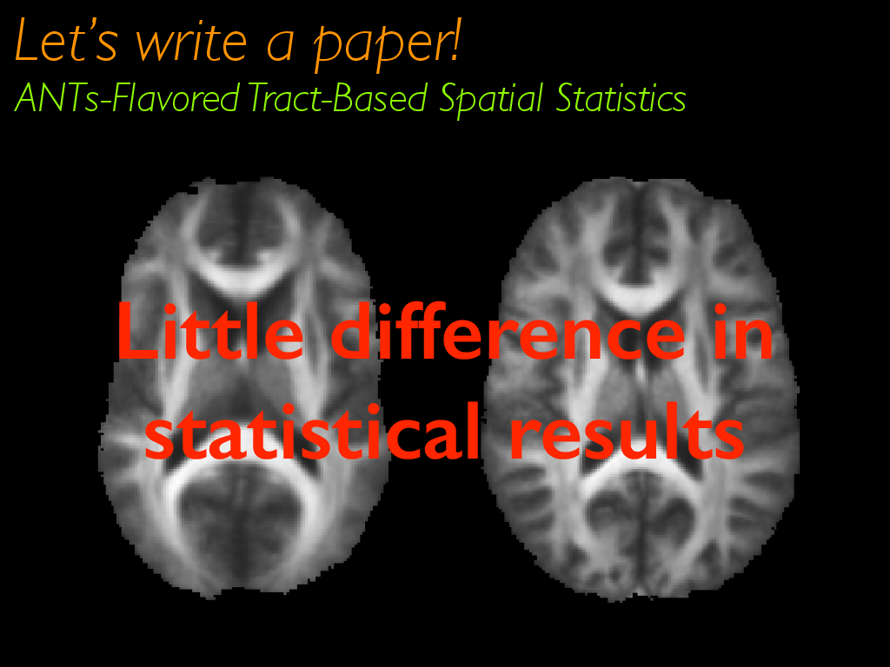

```{r global options, include=FALSE}
library(rmarkdown)
library(knitr)
figpath<-'figures/'
opts_chunk$set(fig.width=9, fig.height=6, fig.path=figpath,
               warning=FALSE, message=FALSE)
```

# Background

##


<!--

## Built on ITK

* image registration framework

* many other classes such as:
    + `itkScalarImageToRGBImageFilter`
    + `itkLabelOverlapMeauresImageFilter`
    + `itkBSplineScatteredDataPointSetToImageFilter`
    + `itkStochasticFractalDimensionImageFilter`

## ANTs development philosophy:<br><small>Assimilate the optimal components of other approaches</small>


_"We are the Borg. Your biological and technological distinctiveness will be added to our own. Resistance is futile."_


## *The Big 5*

* <span style="color:red">image registration</span> (`antsRegistration.cxx`)

* <span style="color:red">bias correction</span> (`N4BiasFieldCorrection.cxx`)

* multivariate template construction (`antsMultivariateTemplateConstruction.sh`)

* multivariate segmentation (`Atropos.cxx`)

* cortical thickness (`KellyKaposki.cxx` and `antsCorticalThickness.sh`)

## *ANTsR*<br>for statistics and visualization

# *ANTs* optimizes mathematically well-defined <span style="color:red;">objective functions</span> guided by <span style="color:red;">prior knowledge</span>  ...

# ... including that of developers, domain experts and other colleagues ...

# plug *your ideas* into our software to gain insight into biomedical data ...

# our strong <span style="color:red;">mathematical and software engineering</span> foundation leads to near limitless opportunities for innovation in a variety of application domains
-->


# ANTs brain morphology<br><br>[<small>"*Large-scale evaluation of ANTs and FreeSurfer cortical thickness measurements*"</small>](http://www.ncbi.nlm.nih.gov/pubmed/24879923)


## Cortical thickness studies:
```{r, results='asis', echo = FALSE}
conditions <- c( "Huntington’s disease", "schizophrenia", "bipolar disorder",
                 "Alzheimer’s disease", "frontotemporal dementia", "Parkinson’s disease",
                 "Williams syndrome", "multiple sclerosis", "autism", "migraines",
                 "chronic smoking", "alcoholism", "cocaine addiction", "Tourette syndrome in children",
                 "scoliosis in female adolescents", "early-onset blindness", "chronic pancreatitis",
                 "obsessive-compulsive disorder", "ADHD", "obesity", "heritable depression",
                 "elderly depression", "age", "gender", "untreated male-to-female transsexuality",
                 "handedness", "intelligence", "athletic ability", "meditative practices", "musical ability",
                 "tendency toward criminality", "childhood sexual abuse in female adolescents",
                 "Tetris-playing ability in female adolescents", "traumatic brain injury" )

conditionsDF <- data.frame( Column1 = conditions[1:floor( 0.5*length(conditions) )], Column2 = conditions[( 1+floor( 0.5*length(conditions) ) ):length(conditions)] )
knitr::kable( conditionsDF )
```

## *ANTs*-related background

* Sandy, Brian, and <span style="color:red;">DiReCT</span>
  + used other tools such as FMRIB's Automated Segmentation Tool (FAST)
  + `KellySlater.cxx`
  * scripts "adequate for Penn data"
* `KellyKapowski.cxx` and `antsCorticalThickness.sh`
* _"Let's evaluate on open data."_
* and, eventually, _"Let's compare with FreeSurfer."_

## The *ANTs* structural brain mapping workflow


## Basic components of the pipeline

<div align="center"></img></div>

1. template building (offline)
2. brain extraction
3. cortical thickness estimation
4. cortical parcellation

## Template building

*Tailor data to your specific cohort*

<div align="center"></img></div>

* Templates representing the average mean shape and intensity are built directly from the cohort to be analyzed, e.g. pediatric vs. middle-aged brains.
* Acquisition and anonymization (e.g. defacing) protocols are often different.

## Template building (cont.)

<div align="center"></img></div>

Each template is [processed](https://github.com/ntustison/antsCookTemplatePriorsExample)
to produce auxiliary images which are used for brain extraction and brain segmentation.

## Brain extraction comparison<br>*ANTs* vs. FreeSurfer

<div align="center"></img></div>

Comparison with de facto standard FreeSurfer package.  Note the difference in separation of
the gray matter from the surrounding CSF.  (0 failures out of 1205 scans)

## Brain segmentation

<div align="center"></img></div>

Randomly selected healthy individuals.  Atropos gets good performance across ages.

## Cortical thickness estimation

<div align="center"></img></div>

In contrast to FreeSurfer which warps coupled surface meshes to segment the gray matter, *ANTs* diffeomorphically registers the white matter to the combined gray/white matters while simultaneously estimating thickness.


## _But without ground truth, how does one evaluate the pipeline?_

* Use age and gender (demographic information) in training/prediction paradigm
* Public data sets (IXI, NKI, Oasis, MMRR)
* $>$ 1200 subjects, age 7 to over 90 years old

## Prediction from cortical thickness data:<br>gender and age

<div align="center"></img></div>


## Regional importance comparison

$AGE \sim VOLUME + GENDER + \sum_{i=1}^{62} T(DKT_i)$

<div align="center"></img></div>

*ANTs* (left) vs. FreeSurfer (right)

## Regional importance comparison (cont.)

<div align="center"></img></div>

## Cortical thickness extensions

# *ANTs* and the perils of circularity<br><br>[<small>"*Logical circularity in voxel-based analysis: normalization strategy may induce statistical bias*"</small>](http://www.ncbi.nlm.nih.gov/pubmed/23151955)

## *ANTs* and the perils of circularity


##


##


##


##


##


##



##


##


##


##


##


##


##


##


##


##


##


## Command line help

<font size="5", color="lightgrey">
```
$ CreateDTICohort -h

COMMAND:
     CreateDTICohort

OPTIONS:
     -d, --image-dimensionality 2/3
     -a, --dti-atlas inputDTIAtlasFileName
     -x, --label-mask-image maskImageFileName
                            lowerThresholdFunction
     -n, --noise-sigma <noiseSigma=18>
     -p, --pathology label[<percentageChangeEig1=-0.05>,<percentageChangeAvgEig2andEig3=0.05>,<numberOfVoxels=all or percentageOfvoxels>]
     -w, --dwi-parameters [B0Image,directionFile,bvalue]
                          [B0Image,schemeFile]
     -r, --registered-population textFileWithFileNames.txt
     -o, --output [outputDirectory,fileNameSeriesRootName,<numberOfControls=10>,<numberOfExperimentals=10>]
     -h
     --help
```
</font>


## Which one is not warped?


## _Answer_


##


##


##


