---

# What is ANTs?

## NLM's The Visible Human Project and The Insight Toolkit

\begin{center}

\includegraphics[width=4.75in]{./figures/VisibleHumanProject_ITK.pdf}

\end{center}

## ANTs _began with a clinical research need._

\begin{center}

\includegraphics[width=4.75in]{./figures/ANTsEvolutionarySummary.pdf}

\end{center}

## Advanced Normalization Tools

\begin{center}

\includegraphics[width=4.75in]{./tools/figures/coreANtsToolsNeuro.png}

\end{center}

## Advanced Normalization Tools $\rightarrow$ ``ITK-Lung''

\begin{center}

\includegraphics[width=4.75in]{./tools/figures/coreANtsToolsLung.png}

\end{center}

<!--

# Competitions

## Algorithmic fight club

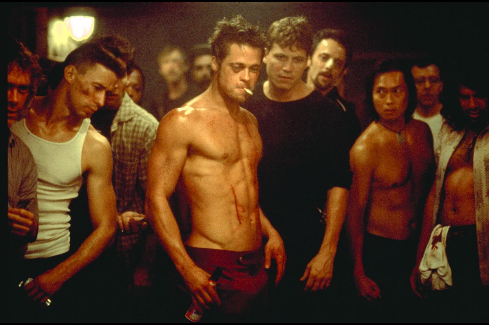

-->

## International competitions

* [Klein 2009](http://www.ncbi.nlm.nih.gov/pubmed/19195496): MRI brain registration

* [EMPIRE 2010](http://empire10.isi.uu.nl):  CT lung registration

* [Multi-Atlas Label Challenge 2012](https://masi.vuse.vanderbilt.edu/workshop2012/index.php/Main_Page):  MRI brain registration and segmentation

* [SATA Challenge 2013](https://masi.vuse.vanderbilt.edu/workshop2013/index.php/MICCAI_2013_SATA_Challenge_and_Workshop:Current_events): MRI cardiac and canine hind leg registration

* [BRATS 2013](http://martinos.org/qtim/miccai2013/): Multi-modal MRI brain segmentation

* [STACOM 2014 MoCo Challenge](http://www.cardiacatlas.org/web/stacom2014/moco-introduction):  MRI cardiac motion estimation

<!--- 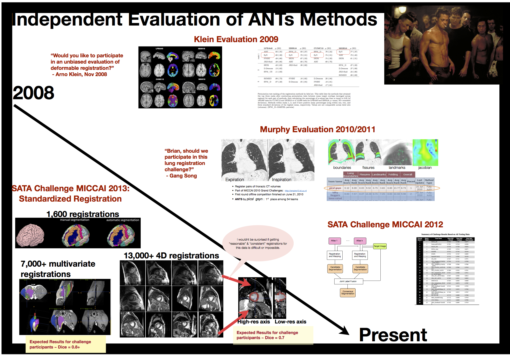 -->


<!--

## Klein, NeuroImage 2009

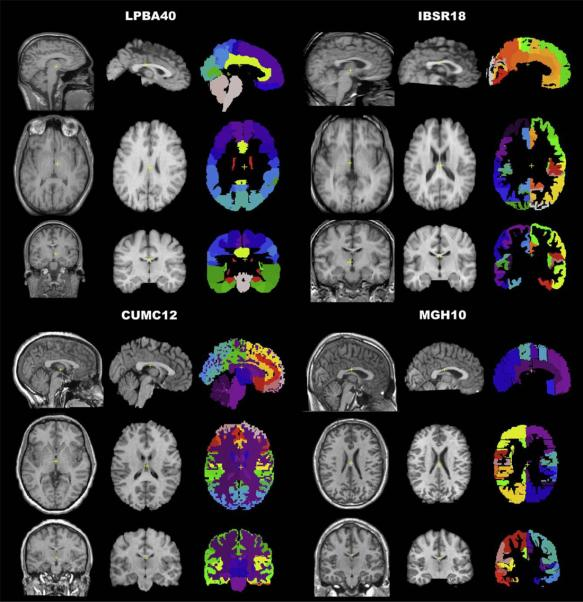

* 14 algorithms
* publicly available data
* different labeling protocols
* developers tune their own algorithms

## Klein results

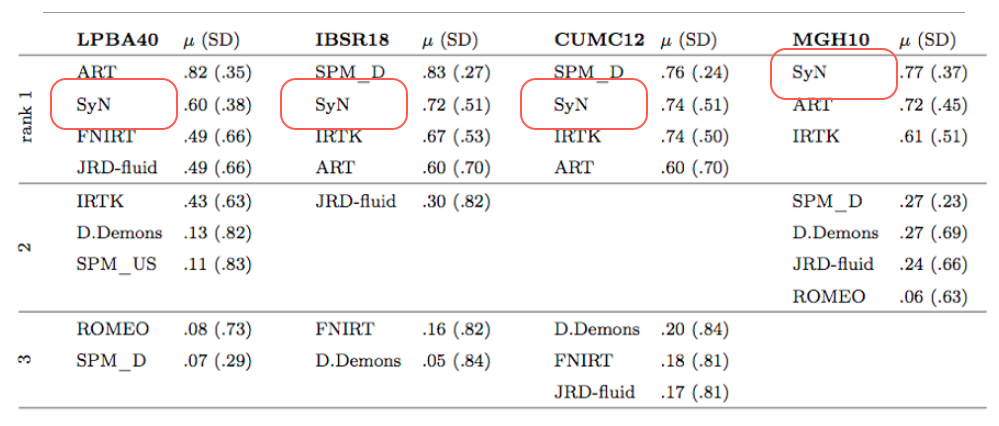

## Take-away message

_"One of the most significant findings of this study is that the relative performances of
the registration methods under comparison appear to be little affected by the choice of
subject population, labeling protocol, and type of overlap measure....  ART, SyN, IRTK, and
SPM's DARTEL Toolbox gave the best results according to overlap and distance measures,
with ART and SyN delivering the most consistently high accuracy across subjects and label sets."_

## EMPIRE 2010

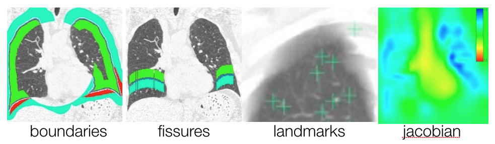

* Alignment of lung boundaries,

* major fissures,

* annotated landmark pairs, and

* topology of displacement field.


## EMPIRE 2010 results


## Multi-atlas 2012


## Multi-atlas 2012 results

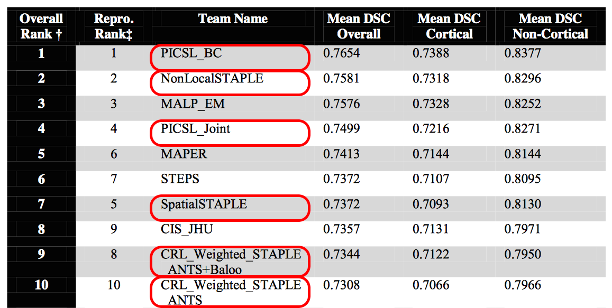

## SATA 2013

Three very different problem domains

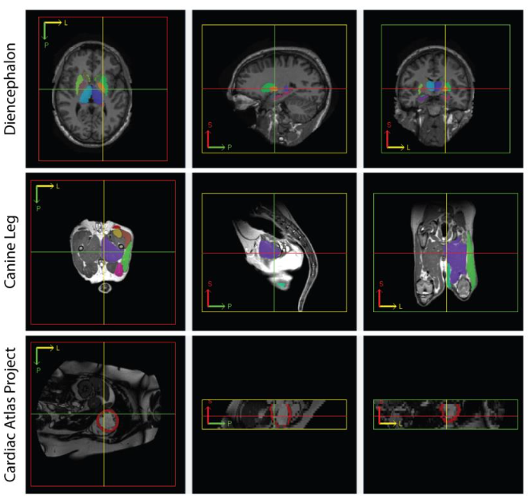


## BRATS 2013

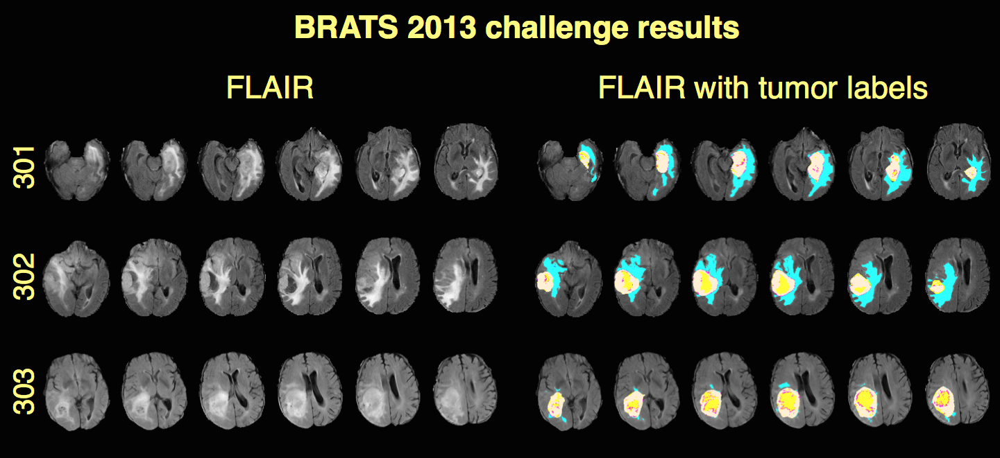

## BRATS 2013 results

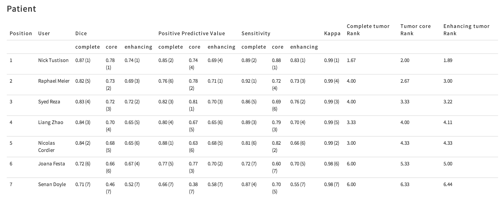

[Tustison, et al., Optimal symmetric multimodal templates and concatenated random forests for
supervised brain tumor segmentation (simplified) with _ANTsR_, _Neuroinformatics_.](http://www.ncbi.nlm.nih.gov/pubmed/25433513)

## STACOM 2014

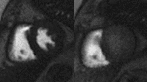

-->

<!--- A great opportunity to showcase a [new SyN variant](http://www.ncbi.nlm.nih.gov/pubmed/24409140) -->

# Putting it all together---the ANTs cortical thickness pipeline

## Cortical thickness studies

\scriptsize

```{r, results='asis', echo = FALSE}
conditions <- c( "Tetris-playing ability", "Huntington’s disease", "schizophrenia", "bipolar disorder",
                 "Alzheimer’s disease", "frontotemporal dementia", "Parkinson’s disease",
                 "Williams syndrome", "multiple sclerosis", "autism", "migraines",
                 "chronic smoking", "alcoholism", "cocaine addiction", "Tourette syndrome in children",
                 "scoliosis in female adolescents", "early-onset blindness", "chronic pancreatitis",
                 "obsessive-compulsive disorder", "ADHD", "obesity", "heritable depression",
                 "elderly depression", "age", "gender",
                 "handedness", "intelligence", "athletic ability", "meditative practices", "musical ability",
                 "tendency toward criminality", "childhood sexual abuse in female adolescents",
                  "traumatic brain injury", "untreated male-to-female transsexuality" )

conditionsDF <- data.frame( Column1 = conditions[1:floor( 0.5*length(conditions) )], Column2 = conditions[( 1+floor( 0.5*length(conditions) ) ):length(conditions)] )
knitr::kable( conditionsDF )
```

<!--

## ANTs-related background

* Sandy, Brian, and <span style="color:red;">DiReCT</span>
    + used other tools such as FMRIB Automated Segmentation Tool (FAST)
    + `KellySlater.cxx`
* pipedream scripts "adequate for Penn data."
* `KellyKapowski.cxx` and `antsCorticalThickness.sh`
* _"Let's evaluate on open data."_
* and, eventually, _"Let's compare with FreeSurfer."_


## Basic components of the pipeline

1. template building (offline)
2. brain extraction
3. cortical thickness estimation
4. cortical parcellation


## Sample results


-->

## The ANTs structural brain mapping workflow

\begin{centering}

\includegraphics[width=4.5in]{./evaluation/figures/pipeline.png}

\end{centering}

## Template building

*Tailor data to your specific cohort*

\begin{centering}

\includegraphics[width=3in]{./evaluation/figures/templates.png}

\end{centering}

\small

* Templates representing the average mean shape and intensity are built directly from the cohort to be analyzed, e.g. pediatric vs. middle-aged brains.  
* Acquisition and anonymization (e.g. defacing) protocols are often different.

## Template priors

\begin{centering}

\includegraphics[width=2.5in]{./evaluation/figures/templatePriors.png}

\end{centering}

\small

Each template is [processed](https://github.com/ntustison/antsCookTemplatePriorsExample)
to produce auxiliary images which are used for brain extraction and brain segmentation.

## Brain extraction comparison

\begin{centering}

\includegraphics[width=3.5in]{./evaluation/figures/brainExtraction.png}

\end{centering}

\small

Comparison with de facto standard FreeSurfer package.  Note the difference in separation of
the gray matter from the surrounding CSF.  (0 failures out of 1205 scans)

## Brain segmentation

\begin{centering}

\includegraphics[width=3.5in]{./evaluation/figures/brainSegmentation.png}

\end{centering}

\small

Randomly selected healthy individuals.  ```Atropos``` gets good performance across ages.


## Cortical thickness maps

\begin{centering}

\includegraphics[width=4in]{./evaluation/figures/corticalThicknessEstimation.png}

\end{centering}

\small

In contrast to FreeSurfer which warps coupled surface meshes to segment the gray matter,
*ANTs* diffeomorphically registers the white matter to the combined gray/white matters
while simultaneously estimating thickness.

----


\begin{centering}

\Large

{\bf But without ground truth, how does one evaluate the pipeline?}

\end{centering}


## Predict age and gender

\begin{centering}

$AGE \sim VOLUME + GENDER + \sum_{i=1}^{62} T(DKT_i)$

\end{centering}

<!--

## Open science principles


* Public data sets (IXI, NKI, OASIS, MMRR)
* $>$ 1200 subjects, age 4 to over 94 years old

-->

## Prediction from cortical thickness data

\begin{centering}

\includegraphics[width=4in]{./evaluation/figures/evaluation.png}

\end{centering}

<!--

## Age prediction per site

\begin{centering}

\includegraphics[width=4in]{./evaluation/figures/agePredictionPerSite.png}

\end{centering}

-->

## Regional importance comparison


\begin{centering}

\small
ANTs (left) vs. FreeSurfer (right)

\includegraphics[width=4in]{./evaluation/figures/antsvfreesurfer_Importance.png}

\end{centering}


## Regional measurements

\begin{centering}

\includegraphics[width=4in]{./evaluation/figures/antsvfreesurfer_regionalPlots.png}

\end{centering}

<!--

# But, wait, there's more!

##  What about using both the T1 & T2?

## ANTs tools are multivariate

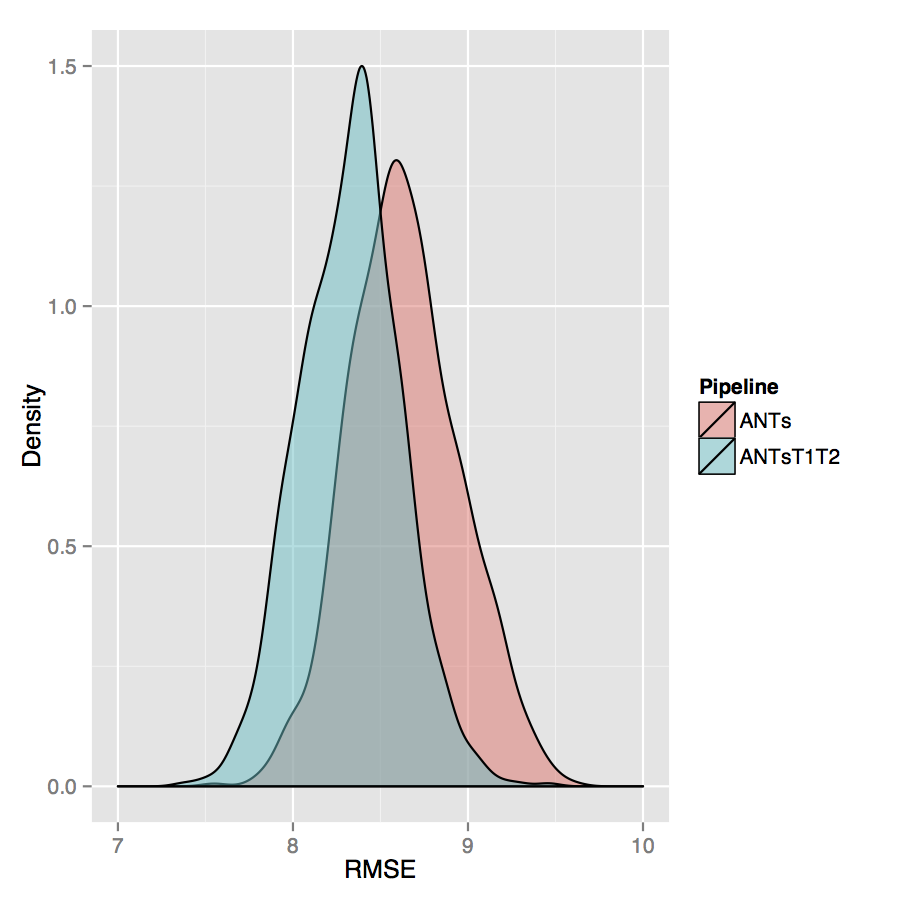

## Arno-thick-in-the-head (ATITH)

_What if we made a crude estimate of the cortical thickness?_

$$thickness_{ROI} = \frac{volume_{ROI}}{area_{ROI}}$$

## Make sure you estimate the [surface area](http://www.insight-journal.org/browse/publication/852) correctly!


----

_So how does ATITH compare with ANTs, FS?_


## Prediction from cortical thickness data


## Brain constellation maps

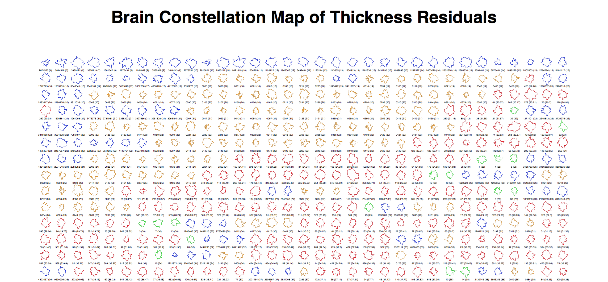


## _Does [denoising](http://www.ncbi.nlm.nih.gov/pubmed/20027588) help?_

## Contribution from Jose

```bash
$ DenoiseImage

COMMAND:
     DenoiseImage
          Denoise an image using a spatially adaptive filter originally described in J. V.
          Manjon, P. Coupe, Luis Marti-Bonmati, D. L. Collins, and M. Robles. Adaptive
          Non-Local Means Denoising of MR Images With Spatially Varying Noise Levels,
          Journal of Magnetic Resonance Imaging, 31:192-203, June 2010.

OPTIONS:
     -d, --image-dimensionality 2/3/4
          This option forces the image to be treated as a specified-dimensional image. If
          not specified, the program tries to infer the dimensionality from the input
          image.

     -i, --input-image inputImageFilename
          A scalar image is expected as input for noise correction.

     -n, --noise-model (Rician)/Gaussian
          Employ a Rician or Gaussian noise model.

     -s, --shrink-factor (1)/2/3/...
          Running noise correction on large images can be time consuming. To lessen
          computation time, the input image can be resampled. The shrink factor, specified
          as a single integer, describes this resampling. Shrink factor = 1 is the
          default.

     -o, --output correctedImage
                  [correctedImage,<noiseImage>]
          The output consists of the noise corrected version of the input image.
          Optionally, one can also output the estimated noise image.

     --version
          Get Version Information.

     -v, --verbose (0)/1
          Verbose output.

     -h
          Print the help menu (short version).

     --help
          Print the help menu.
```

## _Does [denoising](http://www.ncbi.nlm.nih.gov/pubmed/20027588) help?_

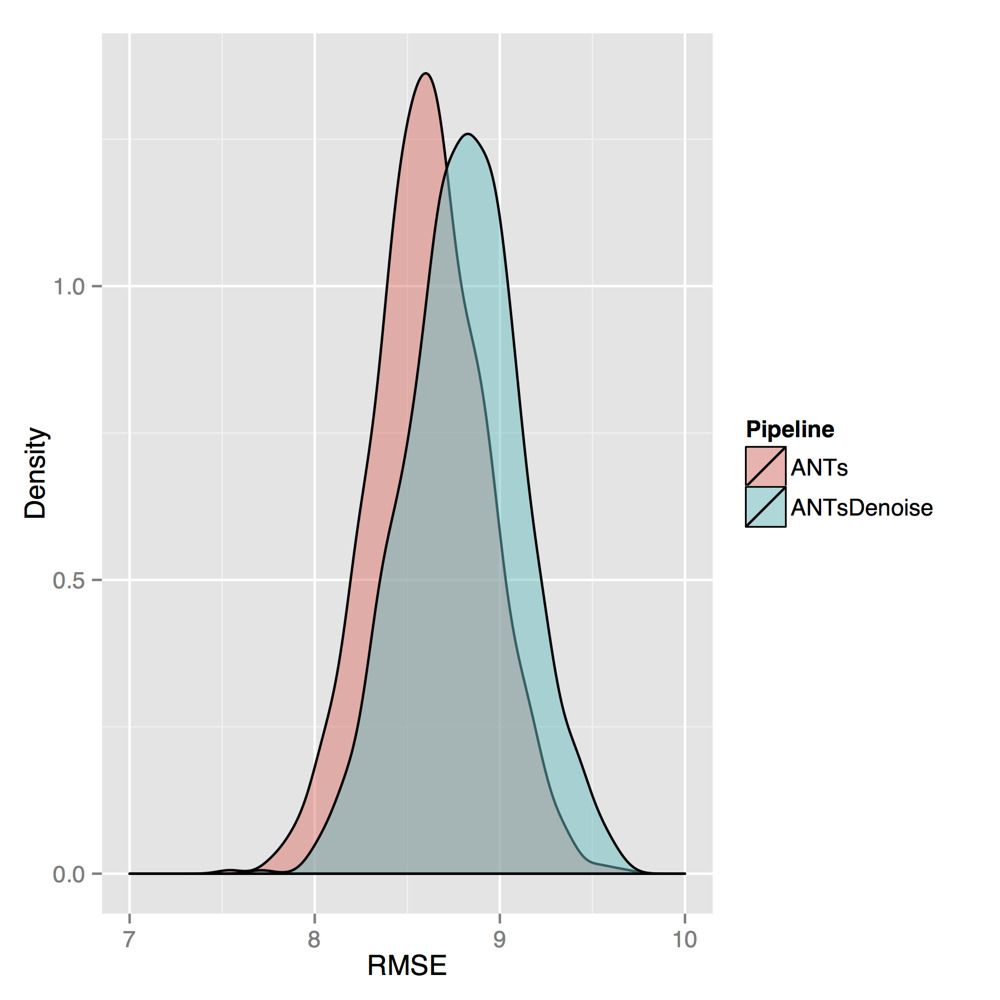

-->

## Longitudinal processing

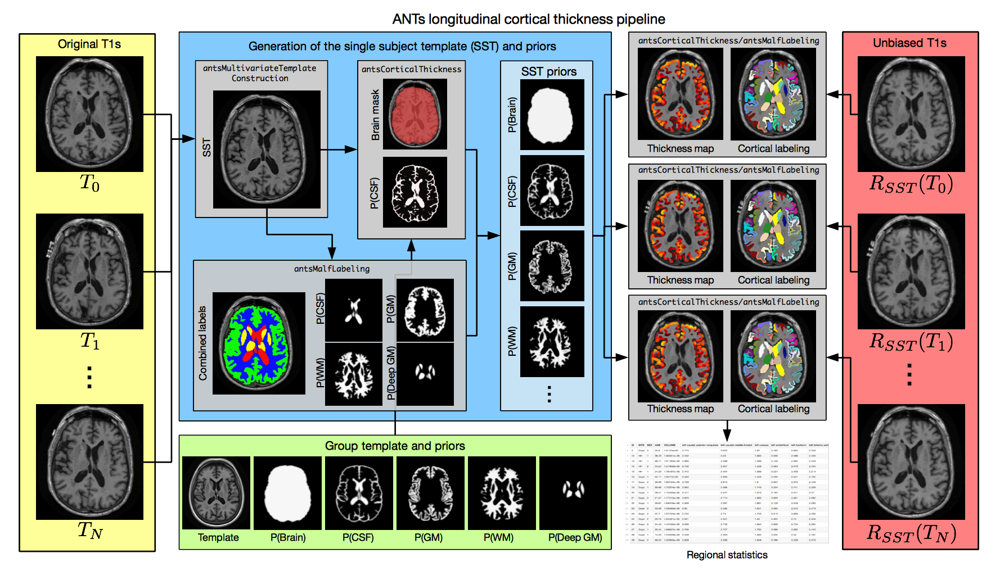

<!--

# But the best part is ...

## it is absolutely ``free''!

```bash
${ANTSPATH}/antsCorticalThickness.sh \
  -a IXI/T1/IXI002-Guys-0828-T1.nii.gz \
  -e IXI/template/T_template0.nii.gz \
  -m IXI/template/T_template0ProbabilityMask.nii.gz \
  -f IXI/template/T_template0ExtractionMask.nii.gz \
  -p IXI/template/Priors/priors%d.nii.gz \
  -o IXI/ANTsResults/IXI002-Guys-0828-
```

----

[__Data availability__](https://github.com/ntustison/KapowskiChronicles)

*  "_Hey, can I have the FreeSurfer measurements for the entorhinal cortex?_"
Sure, why not?---[Hasan, et al., J Neuroimaging](http://www.ncbi.nlm.nih.gov/pubmed/26565394)

*  "_Can I have one or more of the templates that you used for your study?_" Would you like the priors as well?


-->

# Advanced Normalization Tools in R (ANTsR)

## Multimodal Brain Tumor Segmentation (BRATS 2013)

\begin{centering}

\includegraphics[width=4.5in]{./competitions/figures/brats2013results1.png}

\end{centering}

\small

[Tustison, et al., Optimal symmetric multimodal templates and concatenated random forests for
supervised brain tumor segmentation (simplified) with _ANTsR_, _Neuroinformatics_.](http://www.ncbi.nlm.nih.gov/pubmed/25433513)

## White matter hyperintensities in TBI

\begin{centering}

\includegraphics[width=4.5in]{./wmhs/figures/wmhPipeline.png}

\end{centering}


## Social behavior and immunity dysfunction in mice

\begin{centering}

\includegraphics[width=3in]{./antsr/figures/filiano_rsfmri.png}

\end{centering}

## Other ANTsR work

* [Pediatric template of brain perfusion](http://www.nature.com/articles/sdata20153)

* [Automated segmentation of chronic stroke lesions using LINDA: Lesion identification with neighborhood data analysis](http://www.ncbi.nlm.nih.gov/pubmed/26756101)

* [Eigenanatomy](http://www.ncbi.nlm.nih.gov/pubmed/25448483)

* Corrective learning for segmentation refinement

----

## Open source

* https://github.com/stnava/ANTs
* https://github.com/stnava/ANTsR
