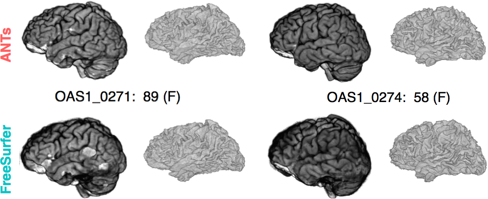

# ANTs versus Freesurfer:   Quantifying *life span* brain health

## "Big data" problem from public resources

TOT, NKI, IXI, Oasis, ADNI ... several thousand images

## ANTs versus Freesurfer:   Quantifying *life span* brain health

* Freesurfer is the historical standard for measuring cortical thickness

* instead of using surfaces to measure cortical thickness, we use the image space *DiReCTly*

* [see this section of a different talk](http://stnava.github.io/ANTsTalk/#/putting-it-all-together-can-we-quantify-life-span-brain-health-in-individuals-and-in-populations) 

* and this "big data" paper: [Large-scale evaluation of ANTs and FreeSurfer cortical thickness measurements](http://www.ncbi.nlm.nih.gov/pubmed/24879923)

* comparison of prediction from automated cortical thickness measurement from 4 public datasets

* $>$ 1200 subjects, age 7 to over 90 years old

* *hint*: ANTs thickness measurements have higher prediction accuracy relative to Freesurfer ( implying we extract more information from the data )

* ANTs methods consistently improve statistical power [eigenanatomy](http://www.ncbi.nlm.nih.gov/pubmed/24687814), [syn](http://www.ncbi.nlm.nih.gov/pubmed/?term=syn+epstein+avants), [itkv4](http://www.ncbi.nlm.nih.gov/pubmed/24817849) ... also, see [Schwarz CG, et al.](http://www.ncbi.nlm.nih.gov/pubmed/24650605) re: TBSS and related work in fMRI [Miller, PNAS](http://www.ncbi.nlm.nih.gov/pubmed/15980148), [Azab, et al in Hippocampus](http://www.ncbi.nlm.nih.gov/pubmed/24167043).

## ANTS vs Freesurfer

</img>

## *ANTs* vs Freesurfer 2

## *ANTs* MALF Labeling

## The *ANTs* structural brain mapping pipeline

[*Large-scale evaluation of *ANTs* and FreeSurfer cortical thickness measurements*, NeuroImage 2014.*](http://www.ncbi.nlm.nih.gov/pubmed/24879923)

All software components are open source and part of the Advanced Normalization Tools (ANTs) repository.

## Basic components of the pipeline

</img>

1. template building (offline)
2. brain extraction
3. cortical thickness estimation
4. cortical parcellation

## Template building

*Tailor data to your specific cohort*

</img>

* Templates representing the average mean shape and intensity are built directly from the cohort to be analyzed, e.g. pediatric vs. middle-aged brains.
* Acquisition and anonymization (e.g. defacing) protocols are often different.

## Template building (cont.)

</img>

Each template is [processed](https://github.com/ntustison/antsCookTemplatePriorsExample)
to produce auxiliary images which are used for brain extraction and brain segmentation.

## Brain extraction

</img>

Comparison with de facto standard FreeSurfer package.  Note the difference in separation of
the gray matter from the surrounding CSF.  (0 failures out of 1205 scans)

## Brain segmentation

</img>

Randomly selected healthy individuals.  Atropos gets good performance across ages.

## Cortical thickness estimation

</img>

In contrast to FreeSurfer which warps coupled surface meshes to segment the gray matter, *ANTs* diffeomorphically registers the white matter to the combined gray/white matters while simultaneously estimating thickness.

